# Adv Access Gateway


A comprehensive solution for secure remote access with multiple authentication methods, intrusion detection, and dynamic security management.

## Table of Contents

- [Project Overview](#project-overview)
- [Features](#features)
- [Security Alignment](#security-alignment)
- [Architecture](#architecture)
- [Installation](#installation)
- [Post-Installation Steps](#post-installation-steps)
- [Authentication Methods](#authentication-methods)
- [Okta RADIUS Integration](#okta-radius-integration)
- [Zero Trust Network Access ZTNA](#zero-trust-network-access-ztna)
- [Client Setup](#client-setup)
- [Site to Site Tunnels](#site-to-site-tunnels)
- [Suricata IDS Integration](#suricata-ids-integration)
- [NGINX Configuration and 404 Tripwire](#nginx-configuration-and-404-tripwire)
- [SHH (System Hardening Helper) Service Sandboxing](#shh-system-hardening-helper-service-sandboxing)
- [Security Features](#security-features)
- [Certificate Management](#certificate-management)
- [Okta Integration for Automated Certificate Management](#okta-integration-for-automated-certificate-management)
- [Vault PKI Administration](#vault-pki-administration)
- [Postfix MTA](#postfix-mta)
- [Syslog-ng Configuration](#syslog-ng-configuration)
- [Administration and Monitoring](#administration-and-monitoring)
- [High Availability (HA)](#high-availability-ha)
- [Appendix](#appendix)

## Project Overview

This project provides a fully-featured ADV VPN Gateway with multiple authentication methods and advanced security features. The system supports both Okta Authentication (EAP-TTLS-PAP) and Public Key (Pubkey) authentication via EAP-TLS, offering flexibility for different client environments. The gateway includes Suricata IDS for enhanced security monitoring, built-in PKI management with HashiCorp Vault, and dynamic traffic filtering.

>**Note**: Required Ports
>
>- UDP ports 4500 and 500
>- ESP protocol 50
>- TCP port 80 (HTTP for CA/CRL delivery)
>- TCP port 8200 (Vault, internal access only)

## Features

- **Multiple Authentication Methods**:
  - **Okta RADIUS Authentication** (EAP-TTLS-PAP)
  - **Certificate-Based Authentication** (EAP-TLS)
  - **EAP-GTC Support** for Linux and macOS clients (experimental, see limitations below)

- **Integrated Security**:
  - **Suricata IDS** with real-time traffic analysis
  - **Python Watchdog** for dynamic IP blacklisting
  - **Fail2Ban** integration
  - **Comprehensive System Hardening**

- **Certificate Management**:
  - **HashiCorp Vault PKI** for certificate generation and revocation
  - **OCSP** for certificate status verification
  - **Easy client certificate deployment** scripts

- **Networking Flexibility**:
  - **Multiple VPN Modes**: NAT, Routed, and DHCP
  - **Site-to-Site VPN** with the `tunnel.sh` utility
  - **XFRM interface** support for advanced routing

- **Monitoring and Logging**:
  - **Syslog-ng** for centralized logging
  - **Automated Log Rotation**
  - **File Integrity Monitoring**
  - **System Performance Metrics**

- **Zero Trust Network Access (ZTNA)**:
  - **Custom updown scripts** for granular access control
  - **Okta group-based access policies**
  - **Dynamic IPset management** for segmentation
  - **Per-zone routing tables**

## Security Alignment

### NIST Special Publications Alignment

- **NIST SP 800-53**:
  - AC-3: Access Enforcement
  - AC-16: Security Attributes
  - IA-2: Identification and Authentication
  - IA-5: Authenticator Management
  - SC-8: Transmission Confidentiality and Integrity
  - SC-12: Cryptographic Key Establishment and Management
- **NIST SP 800-207**:
  - Micro-segmentation
  - Identity-based access control
  - Least-privilege network access
  - Continuous verification

### ISO 27001/27002 Control Mapping

- **A.5 Information Security Policies**:
  - Documentation
  - Security guidelines
  - Configuration management
- **A.9 Access Control**:
  - Multiple authentication methods
  - Role-based access control
  - Certificate-based authentication
  - Dynamic group-based authorization
- **A.10 Cryptography**:
  - HashiCorp Vault PKI
  - Strong encryption
  - Certificate lifecycle management
  - OCSP and CRL support
- **A.12 Operations Security**:
  - Automated patch management
  - Logging
  - Performance monitoring
  - Backup and recovery
- **A.13 Network Security**:
  - Firewall segmentation
  - Intrusion detection
  - VPN encryption
  - Site-to-site VPN

### Additional Security Strengths

- **Multi-layered Security**:
  - PKI integration
  - IDS
  - Zero Trust Network Access
  - Dynamic threat response
- **Compliance-Driven Design**:
  - Modular architecture
  - Extensive documentation
  - Flexible configuration options

- **Operating System**: Debian 12+
- **CPU**: 2+ cores for site-to-site (recommended: 4+ for multiple clients and site-to-site)
- **Memory**: 3-4 GB RAM minimum
- **Storage**: 15+ GB
- **Network**: Static IP address or Domain Name Required

>**Note**: Specifications may need to be increased based on user count and traffic volume.

## Architecture

The ADV Gateway has multiple security and authentication components:

### Core Components

1. **StrongSwan IKEv2 Service**
   - Primary VPN daemon with swanctl configuration
   - Custom-compiled with enhanced security features
   - Support for multiple authentication methods

2. **HashiCorp Vault PKI**
   - Certificate Authority management
   - Client certificate generation and revocation
   - Private key storage and protection
   - OCSP and CRL services

3. **Network Security Layer**
   - NFTables firewall with dynamic rules
   - Suricata IDS for traffic monitoring
   - Python watchdog for automated threat response

4. **Authentication Services**
   - Okta RADIUS integration (EAP-TTLS-PAP)
   - Certificate-based authentication (EAP-TLS)
   - Experimental EAP-GTC support

5. **ZTNA Components**
   - Custom updown scripts for connection management
   - XFRM interface configuration for secure routing
   - IPset list management for zone-based segmentation
   - Dynamic policy application based on Okta group membership

### Architectural Diagram

The overall architecture follows this design:


### Data Flow

1. **Authentication Flow**:
   - Clients connect using IKEv2 protocol on UDP 500/4500
   - Authentication occurs via EAP-TLS (certificates) or EAP-TTLS-PAP (Okta)
   - Upon success, IPsec security associations are established
   - Client receives IP from configured pool (NAT/Routed modes) or DHCP (DHCP mode)
   - For ZTNA mode, Okta groups in RADIUS response determine access policy

2. **Traffic Flow**:
   - All traffic through the IPsec tunnel is encrypted ECP256 or ECP521 group 22 default
   - Traffic can be routed based on configured mode (NAT, Routed, DHCP)
   - For ZTNA, traffic is further segmented based on user's security zone
   - Suricata IDS inspects decrypted traffic for threats
   - Python watchdog monitors Suricata alerts and updates firewall rules
   - NFTables enforces access controls and NAT when required

3. **Certificate Management Flow**:
   - Vault PKI issues certificates on demand
   - NGINX exposes CA certificates and CRLs to clients
   - OCSP provides real-time certificate validity checking
   - Certificate revocation automatically updates CRLs

This architecture provides security through multiple layers of protection while maintaining flexibility for different deployment scenarios.

## Installation

Before starting installation:

1. A clean Debian 12+ installation
2. SSH key-based authentication configured
3. System hostname set using `sudo hostnamectl set-hostname hostname.example.com`

### Quick Installation

```bash
sudo apt-get install git -y && sudo apt-get update -y && 
git clone https://github.com/unsupervised-adult/IKEv2-Okta && 
cd ./IKEv2-Okta && chmod +x ./strongconn.sh && sudo ./strongconn.sh -install
```

### Installation Process

1. The installer will present a VPN Mode selection dialog:

   

2. Configure system settings in the configuration wizard:
   - Set up network interfaces and IP addressing
   - Configure DNS settings
   - Choose authentication methods
   - Enable optional components (ZTNA, Boundary, Suricata IDS)

3. The installation will proceed automatically:
   - Installing required packages
   - Setting up StrongSwan and PKI
   - Configuring Vault for certificate management
   - Installing HashiCorp Boundary (if selected)
   - Setting up ZTNA zones (if enabled)

4. The system will reboot upon completion

> **Note**: Boundary integration is available when using ZTNA. When enabled, Boundary provides fine-grained access control to resources within ZTNA zones. This is especially useful for environments requiring privileged access management and session monitoring.

### VPN Routing Modes

| Mode | Description | Use Case |
|------|-------------|----------|
| **NAT** | - Client pool unreachable from outside  - NAT enabled for client traffic  - Complete network isolation | Best for security-focused deployments requiring network separation |
| **ROUTED** | - Client pool routable  - Zero Trust ZTNA (no NAT)  - Return path routing required | Manual Routing Or ZTNA Configuration |
| **DHCP** | - No separate client pool | |

- DHCP proxy from local network
- Full LAN integration | Best for transparent LAN access and simplest configuration |

## Post-Installation Steps

1. **Check Installation Log**: Review `/var/logs/strongconn.log` for any issues
2. **Run Diagnostics**: `./strongconn.sh -debug`
3. **Generate Client Certificates**: Use `v-pki generate-client email@example.com 365` to create a certificate valid for 1 year

### Optional Post-Install Steps

1. Configure remote syslog by setting `ARCTICWOLF_IP` in `/etc/strongconn.conf`
2. Enable ZTNA features by running `_scripts/ztna.sh`
3. Set up automatic certificate delivery by configuring `SEND_EMAILS=true`
4. Configure Boundary integration if using ZTNA zones
5. Review and customize SHH profiles in `_scripts/profiles.txt`

### Initial Testing

1. **Test Basic Connectivity**:

   ```bash
   ping -I <vpn-interface> 8.8.8.8
   ```

2. **Verify Certificate Service**:

   ```bash
   curl http://your-server/ca
   ```

3. **Check Security Services**:

   ```bash
   systemctl status suricata
   systemctl status fail2ban
   ```

4. **Test Okta Integration** (if configured):

   ```bash
   radtest username password 127.0.0.1 1812 your-secret
   ```

   1. **Check Installation Log**: Review `/var/logs/strongconn.log` for any issues
   2. **Run Diagnostics**: `./strongconn.sh -debug`
   3. **Generate Client Certificates**: Use `v-pki generate-client email@example.com 365` to create a certificate valid for 1 year

## Authentication Methods

### Certificate-Based Authentication (EAP-TLS)

Certificate-based authentication is automatically configured during installation and provides the most secure authentication method, using public key infrastructure to validate clients.

User management for certificate-based authentication is handled through the PKI system using the `v-pki` tool:

```bash
# Create a certificate for a new user
v-pki generate-client user@example.com 365

# Revoke access for a user
v-pki revoke-pki SERIAL_NUMBER

# List all certificates in the PKI
v-pki list

# Export a certificate for a user
v-pki export user@example.com ~/

# Unseal Vault (if sealed, to ensure OCSP service functions properly)
v-pki unseal-vault

# Seal Vault when needed
v-pki seal-vault

# For complete command reference
cat /home/ficus/Documents/IkeV2-Okta/commandref.md
```

## Okta RADIUS Integration

### Overview

This guide provides step-by-step instructions for integrating your  VPN Gateway with Okta for user authentication. The integration supports both standard authentication and Zero Trust Network Access (ZTNA) using the RADIUS agent on the local server (127.0.0.1).

### Prerequisites

- ADV VPN Gateway installed and working
- Administrator access to your Okta account
- The Okta RADIUS Server Agent installed on your VPN server
- A TLS certificate that matches your server's certificate (P12 format)

### Integration Process

#### Step 1: Enable Okta Authentication on VPN Gateway

Begin by configuring your VPN server to use Okta:

```bash
sudo strongconn.sh -write-okta-config
```

This creates the necessary Okta configuration at `/etc/swanctl/conf.d/okta.conf`.

### Step 2: Set Up Okta RADIUS Application

1. **Log in to Okta Admin Console**
   - Navigate to your Okta Admin Console (e.g., <https://yourcompany.okta.com>)
   - Log in with your administrator credentials

2. **Create a RADIUS Application**
   - Go to **Applications → Applications** in the left-hand menu
   - Click **Create App Integration**
   - Select **RADIUS** from the list and click **Next**
   - Name your application:
     - "example  VPN" for standard authentication
     - "ZTNA VPN" for Zero Trust Network Access
   - Click **Next**

3. **Configure RADIUS Settings**
   - For **RADIUS Protocol**, select "Generic RADIUS"
   - For **Host**, enter `127.0.0.1` (since the RADIUS agent is installed locally)
   - For **Port**, enter `1812` (default RADIUS authentication port)
   - For **Shared Secret**, enter the secret from your installation
     - This value is stored in `/etc/strongconn.conf` as `RADIUS_SECRET`
     - Use this exact value to ensure proper authentication
   - Click **Save** to create the application

### Step 3: Configure Authentication Methods

The VPN Gateway supports two authentication flows for Okta:

1. **Inline 2FA**: Users enter their 2FA token each time they connect
2. **Challenge-Based 2FA**: A second prompt appears for 2FA code or SMS push

In the Okta Admin Console:

1. Go to your RADIUS application's **Sign On** tab
2. Select your preferred authentication method:
   - For inline 2FA, configure the "Prompt for factor" setting
   - For challenge-based 2FA, enable "Okta uses the RADIUS Challenge Protocol"

For challenge-based 2FA:

   1. Navigate to your Okta RADIUS application settings
   2. Go to the **Sign On** tab
   3. Locate the "Okta uses the RADIUS Challenge Protocol" option
   4. Enable this setting to support separate 2FA prompts
   5. Save your configuration

For inline 2FA (one-time entry):

   1. In your Okta RADIUS application settings
   2. Go to the **Sign On** tab
   3. Configure the "Prompt for factor" settings
   4. Select "Every sign on" for maximum security
   5. Save your configuration

### Step 4: Configure TLS Certificate

The P12 certificate must match the server's certificate used by StrongSwan:

1. **Locate or Create Your P12 Certificate**
   the certificate can be exported from vault or found in /opt/pki
   - If using an existing certificate:

     ```bash
     # For reference, this is how you would create a new P12 certificate
     openssl pkcs12 -export -in server-cert.pem -inkey server-key.pem \
       -CAfile ca-cert.pem -out server.p12 -name "server" \
       -passout pass:YourSecurePassword
     ```

2. **Verify Certificate Details**

   ```bash
   openssl pkcs12 -in server.p12 -nokeys -passin pass:YourSecurePassword | \
     openssl x509 -noout -text
   ```

   Ensure the certificate matches your VPN server's identity.

3. **Configure Client Distribution**
   - This P12 file will be provided to VPN clients to authenticate the server

### Step 5: Configure ZTNA (Optional)

For Zero Trust Network Access using Okta groups:

1. **Configure Return Attributes**
   - In your Okta RADIUS application, go to **Sign On** tab
   - Scroll to **RADIUS Attributes**
   - Configure Filter-Id attributes to match your ZTNA zones
     - Example: Set Filter-Id to "FinanceDept" for Finance zone users

2. **Map Okta Groups to ZTNA Zones**
   - Ensure your Okta groups align with the zones defined in your ZTNA configuration
   - The VPN Gateway will use the Filter-Id attribute for zone mapping

### Step 6: Test Your Configuration

1. **Check Configuration**

   ```bash
   # Verify RADIUS secret in Okta configuration
   cat /etc/swanctl/conf.d/okta.conf
   
   # Check eap-radius configuration
   cat /etc/strongswan.d/charon/eap-radius.conf
   ```

2. **Test Authentication**
   - Configure a VPN client with:
     - EAP-TTLS and PAP authentication
     - The P12 certificate for server verification
     - Valid Okta user credentials
   - Attempt to connect to the VPN
   - If using ZTNA, check zone assignment in logs:

     ```bash
     cat /var/log/ztna/ztna-updown.log
     ```

### Authentication Flow Details

When a client connects to the VPN:

1. **Initial Connection**: Client establishes IKEv2 connection on UDP 500/4500
2. **EAP-TTLS Setup**: Client and server establish secure TLS tunnel
3. **Credential Submission**: Within the tunnel, client submits credentials (PAP)
4. **Okta Verification**: Credentials forwarded to Okta via RADIUS agent
5. **MFA (if configured)**: Okta prompts for second factor
6. **Authentication Result**: Success/failure returned to StrongSwan
7. **ZTNA Policy (if enabled)**: Group membership determines access zones
8. **Connection Established**: Client receives IP and access rights

### Experimental EAP-GTC Support

> **IMPORTANT**: EAP-GTC support is experimental and provided for Okta 2FA authentication. It has limitations that make it unsuitable for production use.

If you want to test EAP-GTC authentication (typically for Linux/macOS clients):

```bash
sudo strongconn.sh -write-okta-gtc
```

Note that this can interfere with existing EAP-TTLS-PAP authentication as it requires a second RADIUS service, which may conflict with the Okta RADIUS agent.

## Troubleshooting

If you encounter issues:

. **Verify RADIUS Communication**

   ```bash
   # Test RADIUS authentication
   radtest username password 127.0.0.1 1812 YourSharedSecret
   ```

. **Verify Okta Integration**

- Check the Okta Admin Console for failed authentication attempts
- Ensure the RADIUS agent is running on the VPN server

. **Debug Connection Attempts**

   ```bash
   # Watch connection attempts in real-time
   sudo swanctl -T
   ```

. **Validate Certificate Trust**

- Ensure the P12 certificate exactly matches the server's certificate
- Check that clients are properly importing the certificate

### Important Notes

- The P12 certificate must exactly match the server's certificate, not just the CA certificate
- For ZTNA, ensure group names in Okta precisely match your zone configurations
- Monitor RADIUS agent logs for detailed troubleshooting information

## Zero Trust Network Access (ZTNA)

The ADV VPN Gateway provides a robust Zero Trust Network Access (ZTNA) solution that delivers granular, identity-based controls for secure network access. Unlike traditional VPNs that grant broad access, ZTNA dynamically limits connectivity based on user identity, group membership, and security zone definitions. This is accomplished by mapping Okta RADIUS attributes to security zones via the ztna.sh script.

### Technical Overview

ZTNA replaces the “connect first, authenticate later” model with a multi-layered framework that includes:

- **Zone-Based Access Control**  
   Users are assigned to specific zones (e.g., Finance, IT, HR) based on their Okta group membership. Each zone defines the resources available (for example, subnets like `10.1.0.0/24`).

- **XFRM Interface Isolation**  
   Each authenticated client receives a dedicated /32 IP address from the `ZTNA_IP_POOL` and an isolated XFRM interface (e.g., `xfrm-33`) to prevent lateral movement.

- **NFTables Policy Enforcement**  
   High-performance packet filtering is applied via dynamically managed NFTables IP sets (for instance, `zone_finance_clients`) to enforce firewall rules.

- **Okta RADIUS Integration**  
   A local RADIUS service (127.0.0.1:1812) authenticates clients and maps the returned `Filter-Id` attribute to the corresponding security zone.

- **Policy-Based Routing**  
   Custom routing tables and XFRM policies ensure that client traffic is limited to authorized endpoints.

- **Suricata Integration**  
   Decrypted traffic is monitored by Suricata, and a Python watchdog automatically blacklists suspicious IP addresses.

- **Optional HashiCorp Boundary Integration**  
   For enhanced security, Boundary can be enabled to provide session monitoring and dynamic credential management.

### Network Architecture

```bash
                                    ┌─────────────┐
                                    │ User Device │
                                    │ IKEv2 Client│
                                    └──────┬──────┘
                                           │ IKEv2 
                                           ▼          Mapping via RADIUS
                                    ┌─────────────┐                  ┌───────────────────────┐
                                    │ StrongSwan  │ ───────────────▶ Okta Identity Provider │
                                    │ Gateway with│                  └───────────────────────┘
                                    │   ZTNA      │
                                    └──────┬──────┘
                                           │
                           XFRM Interface & IP Set Management
                                           │
                                           ▼
                                 ┌─────────────────┐          Optional          ┌─────────────┐
                                 │   Internal      │◀────────────────────────▶│ HashiCorp   │
                                 │   Resources     │     Boundary Integration   │ Boundary    │
                                 │ (Zone Specific) │                            │(Optional)   │
                                 └─────────────────┘                            └─────────────┘
```

### Connection Flow

1. **IKEv2 Initiation**  
    The client initiates an IKEv2 connection on UDP ports 500/4500.
2. **Authentication via Okta RADIUS**  
    StrongSwan authenticates the client using EAP-TTLS-PAP.
3. **Okta Identity Response**  
    Okta returns identity attributes (such as `Filter-Id`), indicating the user’s group membership.
4. **ZTNA Zone Mapping**  
    The system maps the user to a predefined security zone.
5. **XFRM Interface Creation**  
    A dedicated XFRM interface is established with a unique identifier.
6. **NFTables IP Set Assignment**  
    The client’s assigned IP is added to a zone-specific NFTables set (e.g., `zone_finance_clients`).
7. **Policy Enforcement**  
    Custom routing policies and XFRM rules restrict traffic to authorized resources.
8. **Optional Boundary Routing**  
    For enhanced auditing and security, traffic can be routed through HashiCorp Boundary.

### Prerequisites for ZTNA Setup

#### VPN Gateway

- Deployed in **Routed Mode** (set `VPN_MODE=ROUTED` in `/etc/strongconn.conf`)
- Fully operational StrongSwan IKEv2 VPN Gateway
- Properly configured NFTables firewall

#### Okta

- Active Okta tenant with administrator access
- Installed Okta RADIUS Server Agent (see "Okta RADIUS Integration")
- Predefined Okta user groups corresponding to designated ZTNA zones

#### Network Planning

- A dedicated client IP pool (e.g., `10.200.0.0/24` defined in `ZTNA_IP_POOL`)
- Identified resource subnets per zone with proper return route configurations
- Correct DNS resolution for all required resources

#### Optional: HashiCorp Boundary

- Vault installed and configured for PKI and secrets management
- Boundary integration enabled for additional verification, session monitoring, and dynamic credential management

### ZTNA Setup Guide

#### Step 1: Prepare Your Environment

Verify that the necessary configurations are set:

```bash
grep "VPN_MODE" /etc/strongconn.conf   # Should return ROUTED
grep "RADIUS_SECRET" /etc/strongconn.conf   # Ensure RADIUS is configured
```

#### Step 2: Plan Your Security Zones

Define zones based on your organization’s structure. For example:

| Zone Name   | Okta Group      | Resource Subnets          | Boundary Enabled | Description                |
|-------------|-----------------|---------------------------|------------------|----------------------------|
| Finance     | FinanceDept     | 10.1.0.0/24, 10.2.0.0/24   | Yes              | Financial systems          |
| Engineering | EngineeringTeam | 10.3.0.0/24, 10.4.0.0/24   | No               | Development environments   |
| Management  | LeadershipTeam  | 10.1.0.0/24, 10.3.0.0/24   | Yes              | Multi-department access    |

#### Step 3: Run the ZTNA Setup Script

Execute the interactive script:

```bash
sudo _scripts/ztna.sh
```

During the interactive setup, you will be prompted to:

- Enter a unique name for each zone (e.g., Finance)
- Specify the corresponding Okta RADIUS attribute (e.g., FinanceDept)
- Define space-separated IPs or subnets for the zone (e.g., `10.1.0.0/24 10.2.0.0/24`)
- Choose whether to enable Boundary for the zone

#### Step 4: Apply and Test Configuration

The script will:

- Generate configuration files (e.g., `/etc/zt/ztna.conf/zones.conf`)
- Reload NFTables and SwanCtl profiles
- Create updown scripts for connection management

Test connectivity by connecting a client with valid Okta credentials, then verify zone assignment:

```bash
tail -f /var/log/ztna/ztna-updown.log
```

#### Boundary Integration (Optional)

When enabled, HashiCorp Boundary adds:

- **Fine-Grained Access Control:** Limits access to specific services (e.g., RDP on port 3389).
- **Session Monitoring:** Records and audits all sessions.
- **Dynamic Credentials:** Issues temporary credentials for resource access.

Boundary is automatically installed if selected, with configurations stored in `/etc/boundary/zones/[zone-id]/credentials.txt`. Access the Boundary Web UI via:

```bash
https://[server-ip]:9200
```

Login with the zone-specific credentials provided.

### Example CLI Commands

**Create and Connect to a Target with Boundary:**

```bash
# Create a target
boundary targets create -name "Finance-RDP" -type tcp -address "10.1.0.5" -port 3389 -scope-id "p_[finance-project-id]"

# Connect to the target
boundary connect -target-id tgt_[target-id]
```

---

### Configuration Files

- **/etc/zt/ztna.conf/zones.conf**  

   ```bash
   ZTNA_ZONE_COUNT="3"
   ZTNA_IP_POOL="10.200.0.0/24"
   ZTNA_ZONE_finance_NAME="Finance"
   ZTNA_ZONE_finance_RESOURCES="10.1.0.0/24 10.2.0.0/24"
   ZTNA_ZONE_finance_OKTA_RAD_ATTRIB="FinanceDept"
   ```

- **/etc/nftables.d/zone_finance.conf**  
   Defines NFTables sets and rules for the Finance zone.

- **/var/lib/strongswan/ztna-updown.sh**  
   Manages connection events (e.g., XFRM interface creation).

- **/etc/swanctl/conf.d/ztna.conf**  
   Configures the IKEv2 ZTNA profile.

---

#### Monitor Logs

```bash
tail -f /var/log/ztna/ztna-updown.log
```

#### Issues and Solutions

- **No Zone Assignment:**  
  - Verify Okta attribute in logs:

      ```bash
      grep "RADIUS attribute" /var/log/strongswan.log
      ```

  - Check zone configuration:

      ```bash
      cat /etc/zt/ztna.conf/zones.conf
      ```

- **Access Denied:**  
  - Inspect XFRM policies:

      ```bash
      ip xfrm policy
      ```

  - Verify NFTables rules:

      ```bash
      sudo nft list chain inet firewall filter_FORWARD_ZTNA_*
      ```

- **Boundary Errors:**  
  - Review Boundary service logs:

      ```bash
      journalctl -u boundary
      ```

  - Verify Vault status:

      ```bash
      curl -k https://127.0.0.1:8200/v1/sys/health
      ```

## Okta Integration for Automated Certificate Management

The gateway includes Okta-based automated certificate management that requires a container environment to run the Okta Provisioning Agent, which is only available as an RPM package.
 **pki ZTNA possible future feature.**

### Container Setup Requirements

1. **Install Podman**:

   ```bash
   apt-get install podman -y
   ```

2. **Build the Container**:
   Use the provided Dockerfile in the repository to build a container that can run the Okta Provisioning Agent:

   ```bash
   cd /podman/DOCKERFILE
   podman build -t okta-agent .
   ```

3. **Run the Container**:

   ```bash
   podman run -d --name okta-pki-agent -p 5000:5000 okta-agent
   ```

#### Configuration Steps

1. **Configure the Okta Event Hook**:
   - In Okta Admin Console, go to Workflow → Event Hooks
   - Create a new Event Hook pointing to `http://your-vpn-server:5000/okta/event-hook/`
   - Subscribe to: `user.lifecycle.deactivate`, `group.user_membership.add`, `group.user_membership.remove`

2. **Set the designated group in configuration**:

   ```bash
   ALLOWED_GROUP="Allowed VPN Users"
   ```

#### Testing the Integration

1. Add a user to the designated Okta group
2. Check logs to confirm certificate generation:

   ```bash
   podman logs okta-pki-agent
   ```

3. Verify the certificate was created:

   ```bash
   v-pki list | grep user@example.com
   ```

## Updating StrongSwan

The system implements compiler restrictions for security purposes. When updating StrongSwan, follow these specific instructions to avoid permission issues.

### Update Process

```bash
# DO NOT use sudo directly with the update command
# Instead, first become root
su -
# OR
sudo -i

# Then navigate to source directory and uninstall current version
cd /usr/src/strongswan-*
make uninstall

# Return to normal directory
cd ~

# Now run the update script
strongconn.sh -update
```

#### Strongswan Updates

1. **Configuration Backup**: While the update script automatically backs up your configuration, it's strongly recommended to create a manual backup before proceeding:

   ```bash
   # Create a manual backup
   tar -czf ~/strongswan-config-backup-$(date +%Y%m%d).tar.gz /etc/swanctl /etc/strongswan.d /etc/strongswan.conf
   ```

2. **Compiler Restrictions**: The system restricts compiler usage as a security measure. Running the update with `sudo` directly will fail due to these restrictions, which is why you must switch to the root user first.

3. **Update Process Details**:
   - The script checks for an existing installation
   - Backs up all configuration files to `/var/backups/`
   - Downloads and compiles the latest StrongSwan version
   - Restores your original configuration
   - Restarts the necessary services

4. **Verification**: After updating, verify your VPN services are working correctly:

   ```bash
   # Check StrongSwan service status
   systemctl status strongswan

   # Verify connections are loading properly
   swanctl --list-conns
   
   # Full debug information
   strongconn.sh -debug
   ```

If you encounter issues after updating, you can restore from your backup:

```bash
# Restore from the automatic backup
cp -a /var/backups/strongswan-config-* /etc/

# OR restore from your manual backup
tar -xzf ~/strongswan-config-backup-*.tar.gz -C /
```

## Client Setup

### Windows Client VPN Setup

For Windows clients, certificate bundles are generated in `/opt/pki/` when creating a client certificate. The bundle contains:

- P12 certificate file for import
- PowerShell setup script for automated configuration

#### Windows GUI Installer Tool

The system includes a Windows GUI installer tool (`vpn-tool-1.7.50.0.exe`) that simplifies VPN setup and configuration. This tool allows users to:

- Install, configure, and manage VPN connections
- Toggle between Full Tunnel and Split Tunnel modes
- Connect to VPN through a simple interface
- Restart IPsec services
- View connection status
- Import CA certificates automatically
- Configure DNS suffixes and routing

#### Windows Tool Compilation

The Windows GUI installer is provided as a compiled executable, but you can also compile your own version from the included PowerShell script:

- The source PowerShell script is located at `_client/winform-installer.ps1`
- This script needs to be compiled to an .exe file using one of these methods:
  - PowerShell Studio (commercial)
  - Visual Studio with appropriate PowerShell extensions
  - PS2EXE (open-source tool, `win-ps2exe`)

Compiling your own version allows for customizations and ensures full control over the deployment package.

#### Configuration Settings

The VPN Tool uses a `.config` file to store settings. If this file doesn't exist when the tool is first run, it will create a new empty configuration and allow you to enter custom details through the Settings interface. This approach provides flexibility rather than hard-coding connection parameters:

- If you distribute the executable with a pre-configured `.config` file, users get standardized settings
- If no config exists, users can create their own settings through the GUI
- All settings are saved to the same directory as the executable

The configuration contains essential parameters:

```xml
<configuration>
  <appSettings>
    <add key="vpnName" value="vpn.example.com" />
    <add key="serverAddress" value="vpn.example.com" />
    <add key="destinationPrefixes" value="10.250.0.0/16,10.242.0.0/16,10.240.0.0/16" />
    <add key="dnsSuffixes" value="example.com,internal.example.com" />
    <add key="caUrl" value="http://vpn.example.com/ca" />
    <add key="crlUrl" value="http://vpn.example.com/crl" />
    <add key="pullCA" value="true" />
    <add key="pullCRL" value="true" />
    <add key="useDnsSuffixInDnsRegistration" value="true" />
  </appSettings>
</configuration>
```

Each setting controls a specific aspect of the VPN connection:

- `vpnName`: The display name for the VPN connection
- `serverAddress`: The VPN server's hostname or IP address
- `destinationPrefixes`: Comma-separated list of subnets routed through the VPN
- `dnsSuffixes`: DNS suffixes to add for DNS resolution through the VPN
- `caUrl`/`crlUrl`: URLs to fetch CA certificate and certificate revocation list
- `pullCA`/`pullCRL`: Whether to automatically download these during installation
- `useDnsSuffixInDnsRegistration`: Controls DNS registration behavior

#### Using the Windows VPN Tool

1. Ensure both the `.exe` and `.config` files are in the same directory
2. Run the installer as Administrator
3. The tool provides several options:
   - **Connect**: Opens the Windows RAS Phone book for direct connection
   - **Install/Okta**: Sets up a connection using Okta authentication (EAP-TTLS)
   - **Install/TLS**: Sets up a connection using certificate authentication (EAP-TLS)
   - **Uninstall**: Removes the selected VPN profile
   - **Apply**: Changes tunnel type (Split or Full)
   - **Restart/Srv**: Restarts IPsec services for troubleshooting

#### Common Troubleshooting Steps

If connection issues occur, try these troubleshooting steps:

1. **IPsec Service Reset**: Click the "Restart/Srv" button to restart the Windows IPsec services. This resolves most common dialer issues without needing to reboot the system.

2. **Verify Settings**: Click the "Settings" link to check if all configuration parameters are correct. You can edit and save them directly from this interface.

3. **Certificate Issues**: If you receive certificate errors, try:
   - Clicking "Settings" → "Pull CA/CRL Certificates" to refresh certificates
   - "Settings" → "Remove Installed CA" and then reinstalling the VPN

4. **Connection Mode**: If split tunneling isn't working correctly, try toggling between Full Tunnel and Split Tunnel modes using the respective checkboxes and clicking "Apply".

5. **Windows Rasphone Dialer**: If direct connection fails, click "Connect" to open the Windows Rasphone dialer and attempt connection from there.

The tool runs minimized in the system tray after initial setup, allowing quick access to connection functions by double-clicking the tray icon. The status of the VPN connection is displayed in the system tray tooltip.

#### Manual Import Steps

Alternatively, you can manually import certificates and configure the VPN:

1. Extract the P12 certificate file from the .tgz archive
2. Right-click and select "Import" to add to the Windows certificate store
3. Run the included PowerShell script to configure the VPN connection

### macOS Client Setup

The project includes a dedicated macOS client script (`macOS-client-brew-ikev2.sh`) that provides reliable split tunneling by configuring StrongSwan as a service rather than relying on the built-in VPN client.

#### Features of the macOS Client

- Proper split tunneling support
- Custom IPsec service installation
- Automatic Homebrew dependency management
- Certificate import and configuration
- Support for high-security encryption settings
- Reliable DNS resolution for VPN resources

#### Installation Process Steps

1. Install your P12 certificate file on your macOS system
2. Run the installer script:

```bash
chmod +x macOS-client-brew-ikev2.sh
./macOS-client-brew-ikev2.sh
```

1. Follow the prompts to provide:
   - Path to your P12 certificate file
   - P12 file password
   - VPN server address

2. The script will:
   - Install StrongSwan via Homebrew if needed
   - Extract and configure certificates
   - Create proper StrongSwan configuration
   - Enable split tunneling for designated subnets

3. Control the VPN connection using:

```bash
sudo ipsec start   # Start the VPN connection
sudo ipsec status  # Check connection status
sudo ipsec stop    # Stop the VPN connection
```

#### Linux Client Setup

Three Linux client installers are provided for different requirements:

1. **Standard Certificate-based Client**: `strongswan.client-ikev2.sh` for any Linux distribution using certificate authentication
2. **Debian-based Systems with EAP-GTC** (Experimental): `eap-gtc-client-deb_builder.sh` for Ubuntu/Debian with Okta authentication
3. **RPM-based Systems with EAP-GTC** (Experimental): `eap-gtc-client-rpm_builder.sh` for RHEL/CentOS/Fedora with Okta authentication

These scripts overcome the limitations of Network Manager by creating a dedicated StrongSwan service with proper split tunneling.

> **Warning**: The EAP-GTC client scripts are experimental and only for testing. Don't use in production.

##### Features of the Linux Clients

- Custom-compiled StrongSwan with optimized configuration
- XFRM interface support for better routing
- Systemd service for reliable connection management
- Table-based policy routing for effective split tunneling
- Support for both EAP-GTC authentication (Okta, experimental) and X.509 certificate authentication
- Cross-distribution compatibility

#### Installation Steps

##### Build Debian-based Package with Okta Authentication (Experimental)

```bash
sudo bash eap-gtc-client-deb_builder.sh
```

##### Build RPM-based Package with Okta Authentication (Experimental)

```bash
sudo bash eap-gtc-client-rpm_builder.sh
```

##### For Standard Certificate-based Authentication (Any Linux)

```bash
sudo bash strongswan.client-ikev2.sh
```

During installation of the standard client, you'll be prompted to provide:

1. Default interface name (e.g., eth0)
2. Connection name
3. Server address
4. Path to your PKCS#12 certificate file
5. Password for the certificate file

The installation process will:

- Install StrongSwan dependencies
- Extract your certificates
- Configure the connection
- Create a systemd service for connection management
- Set up proper routing tables for split tunneling

All clients handle complex routing automatically, creating a dedicated routing table and XFRM interface for VPN traffic, ensuring that only specified traffic traverses the VPN.

#### Managing the Linux VPN Connection

```bash
# Start the VPN service
sudo systemctl start strongswan.client

# Check connection status
sudo swanctl -l

# Stop the VPN service
sudo systemctl stop strongswan.client

# Enable VPN to start at boot
sudo systemctl enable strongswan.client
```

For both macOS and Linux clients, this approach provides more reliable split tunneling than built-in clients, particularly in dynamic network environments.

## Site-to-Site tunnels

The ADV VPN Gateway includes robust site-to-site VPN capabilities through the `tunnel.sh` script and automated tunnel monitoring with the `tunnel-watchdog.sh` service. These components work together to provide secure, reliable connectivity between multiple locations with minimal administrative overhead.

### Overview of Site-to-Site Capabilities

The `tunnel.sh` script automates the deployment and management of IPsec site-to-site VPN tunnels, creating a secure connection between two ADV VPN gateways. It handles all aspects of tunnel configuration:

- Secure automatic CA certificate exchange between endpoints
- XFRM interface creation with proper isolation
- Advanced routing table configuration
- Comprehensive NFTables firewall rules
- Connection monitoring and failover
- Support for multiple tunnels with different configurations

Each tunnel can operate in one of two roles:

- **Master**: Acts as a passive endpoint, waiting for initiators to connect
- **Initiator**: Actively establishes and maintains the connection to the master

### Site to Site Architecture

```plaintext
Master Gateway                                       Initiator Gateway
────────────────                                     ─────────────────
┌────────────┐                                       ┌────────────┐
│ StrongSwan │                                       │ StrongSwan │
└─────┬──────┘                                       └─────┬──────┘
      │                                                    │
┌─────▼──────┐  Certificate Exchange over HTTP      ┌─────▼──────┐
│ NGINX/CA   │◄─────────────────────────────────────┤ CA Fetcher │
└─────┬──────┘                                      └─────┬──────┘
      │                                                   │
┌─────▼──────┐         IKEv2 over UDP 500/4500     ┌─────▼──────┐
│ IKE Daemon │◄────────────────────────────────────┤ IKE Daemon │
└─────┬──────┘                                     └─────┬──────┘
      │                                                  │
┌─────▼──────┐                                     ┌─────▼──────┐
│xfrm-tunnel │         IPsec ESP Protocol          │xfrm-tunnel │
│ Interface  │◄────────────────────────────────────┤ Interface  │
└─────┬──────┘                                     └─────┬──────┘
      │                                                  │
┌─────▼──────┐                                     ┌─────▼──────┐
│NFTables Rules        Protected Traffic           │NFTables Rules
└─────┬──────┘◄────────────────────────────────────┘─────┬──────┘
      │                                                  │
┌─────▼──────┐                                     ┌─────▼──────┐
│ Local Net  │                                     │ Local Net  │
└────────────┘                                     └────────────┘
```

### Network Isolation and Security

Each tunnel creates:

1. **Dedicated XFRM Interface**: Virtual interface that securely encapsulates all tunnel traffic (e.g., `xfrm-site1`)
2. **Isolated Routing Table**: Dedicated routing table to ensure traffic separation
3. **Specific Firewall Rules**: NFTables rules to control traffic flow between networks
4. **MSS Clamping**: Automatic adjustment of TCP MSS to prevent fragmentation issues

This design provides strict traffic isolation, ensuring each tunnel only carries authorized traffic between explicitly defined subnets.

### Automated Tunnel Monitoring

The system includes a robust watchdog service (`tunnel-watchdog.sh`) that continuously monitors all site-to-site tunnels and automatically recovers from common failure conditions:

#### Monitoring Capabilities

- **Connectivity Verification**: Actively tests if traffic can pass through each tunnel
- **Interface State Checking**: Ensures XFRM interfaces are properly configured and active
- **SA Status Monitoring**: Verifies that IPsec security associations are established
- **Multiple Recovery Methods**: Attempts various recovery techniques based on failure type
- **Intelligent Subnet Detection**: Automatically identifies appropriate target IPs for testing

#### Recovery Mechanisms

When a failure is detected, the watchdog:

1. **Terminates Stale Connections**: Safely closes any half-open or stuck IPsec SAs
2. **Restarts Systemd Services**: For initiator nodes, restarts the tunnel-specific service
3. **Reloads Configurations**: Ensures current configurations are applied
4. **Gradually Escalates Recovery**: Uses multiple recovery attempts with increasing scope
5. **Detailed Logging**: Provides comprehensive logs of all monitoring and recovery actions

### Basic Usage Example

#### Setting Up a Master Node

```bash
sudo tunnel.sh --name site1 --role master \
  --remote-ip 192.168.1.2 \
  --local-subnet 10.10.0.0/16 \
  --remote-subnet 10.20.0.0/16 \
  --initiator-id 2
```

#### Setting Up an Initiator Node

```bash
sudo tunnel.sh --name site1 --role initiator \
  --remote-ip 192.168.1.1 \
  --local-subnet 10.20.0.0/16 \
  --remote-subnet 10.10.0.0/16 \
  --initiator-id 2
```

The initiator node will automatically:

- Fetch the CA certificate from the master
- Create a systemd service to manage the connection
- Establish and maintain the VPN tunnel

### Advanced Usage Examples

#### Hub and Spoke Configuration

Setting up a central hub with multiple remote sites:

**On Hub (Master):**

```bash
# First spoke configuration
sudo tunnel.sh --name site1 --role master \
  --remote-ip 192.168.1.2 \
  --local-subnet 10.10.0.0/16,10.30.0.0/16 \
  --remote-subnet 10.20.0.0/16 \
  --initiator-id 2

# Second spoke configuration
sudo tunnel.sh --name site2 --role master \
  --remote-ip 192.168.1.3 \
  --local-subnet 10.10.0.0/16,10.20.0.0/16 \
  --remote-subnet 10.30.0.0/16 \
  --initiator-id 3
```

**On First Spoke (Initiator):**

```bash
sudo tunnel.sh --name site1 --role initiator \
  --remote-ip 192.168.1.1 \
  --local-subnet 10.20.0.0/16 \
  --remote-subnet 10.10.0.0/16,10.30.0.0/16 \
  --initiator-id 2
```

**On Second Spoke (Initiator):**

```bash
sudo tunnel.sh --name site2 --role initiator \
  --remote-ip 192.168.1.1 \
  --local-subnet 10.30.0.0/16 \
  --remote-subnet 10.10.0.0/16,10.20.0.0/16 \
  --initiator-id 3
```

This configuration enables communication between all sites, with the hub routing traffic between spokes.

#### Monitoring and Managing Tunnels

The tunnel-watchdog service automatically starts when the first tunnel is created. You can manually check tunnel status with:

```bash
# View service status
systemctl status tunnel-watchdog

# Check tunnel-specific service (for initiators)
systemctl status strongswan-client-site1

# Examine watchdog logs
tail -f /var/log/tunnel-watchdog.log

# View tunnel connections
swanctl --list-sas | grep site_to_site

# Check XFRM interfaces
ip link show | grep xfrm-
```

#### Removing a Tunnel

```bash
sudo tunnel.sh --name site1 --initiator-id 2 --teardown
```

This command:

- Terminates the active connection
- Removes the XFRM interface
- Deletes all related firewall rules
- Removes the systemd service (on initiator nodes)
- Cleans up all configuration files

### Command-Line Options

The tunnel.sh script supports these parameters:

| Parameter | Description | Example |
|-----------|-------------|---------|
| `--name` | Tunnel name (letters, numbers, underscore) | `--name site1` |
| `--role` | Node role (master/initiator) | `--role initiator` |
| `--remote-ip` | IP address of the other VPN gateway | `--remote-ip 192.168.1.2` |
| `--local-subnet` | Local subnets to share (comma-separated) | `--local-subnet 10.1.0.0/24,10.2.0.0/24` |
| `--remote-subnet` | Remote subnets to access (comma-separated) | `--remote-subnet 10.3.0.0/24` |
| `--initiator-id` | Unique ID for initiator (2 or higher) | `--initiator-id 2` |
| `--if-id` | XFRM interface ID (auto-generated if omitted) | `--if-id 1234` |
| `--teardown` | Remove and clean up the tunnel | `--teardown` |

### Tunnel-Watchdog Configuration

The watchdog service can be customized via commandline parameters or by editing the systemd service file:

```bash
# Manual execution with options
sudo tunnel-watchdog.sh --interval 30 --verbose

# Edit systemd service for permanent changes
sudo systemctl edit tunnel-watchdog.service
```

Available settings:

| Setting | Default | Description |
|---------|---------|-------------|
| `--interval` | 60 | Seconds between checks |
| `--verbose` | false | Enable detailed logging |
| `--config` | /etc/strongconn.conf | Path to main configuration file |

The watchdog automatically adjusts its behavior based on tunnel configurations and network layout, requiring minimal manual tuning.

### Security Notes

- Each tunnel creates a segregated network path with unique encryption keys
- All traffic is secured with AES-256 and strong ECP521 curves
- Tunnels use certificate-based authentication with separate CA trust
- MSS clamping ensures optimal packet sizes to avoid fragmentation attacks
- NFTables rules enforce strict traffic control
- StrongSwan implements Perfect Forward Secrecy for all connections

### Performance Considerations

- Each tunnel requires approximately 10-15 MB of RAM
- Tunnel initiation takes 1-3 seconds in most environments
- The watchdog service consumes minimal resources (checking every 60s by default)
- Each tunnel can reach near-line-rate throughput on modern hardware

### Implementation Best Practices

1. **Plan subnet allocation carefully**: Ensure no overlap between sites
2. **Use subnet aggregation**: Combine related subnets to minimize tunnel count
3. **Consider BGP for complex networks**: For large deployments, configure BGP over IPsec
4. **Monitor watchdog logs**: Review `/var/log/tunnel-watchdog.log` regularly
5. **Test failover scenarios**: Periodically validate automatic recovery functions

## Security Features

### Firewall Implementation

The StrongSwan gateway uses NFTables firewall protection:

#### NFTables Architecture

The firewall is organized into several key components:

1. **Dynamic Sets**:
   - `blacklisted_ips`: Automatically populated by Suricata watchdog and Fail2Ban
   - `whitelisted_ips`: Pre-configured with internal networks and trusted IPs
   - `zone_members`: Maps client IPs to security zones for ZTNA implementation

2. **Chain Organization**:
   - **Input Chains**: Filter incoming traffic based on source zones
   - **Forward Chains**: Manage transit traffic between interfaces
   - **NAT Chains**: Handle address translation for different VPN modes

3. **Routing Mode Adaptation**:
   - NAT mode: Automatic masquerading for client traffic
   - Routed mode: Direct packet forwarding ZTNA Profile
   - DHCP mode: LAN DHCP proxy IPsec clients no client pool

#### Dynamic IP Blocking

The system implements a dynamic IP blocking mechanism:

```bash
ip saddr @blacklisted_ips log prefix "BLACKLIST DROP: " limit rate 10/second counter drop
```

When the Suricata watchdog detects suspicious activity, it adds the source IP or Destination IP to the `blacklisted_ips` set with a configurable timeout period (default 7 days). This provides protection against emerging threats.

#### Client Traffic Management

Based on the selected VPN mode, the firewall automatically configures appropriate rules for client traffic:

- **NAT Mode**:

  ```bash
  oifname "$DEFAULT_INTERFACE" ip saddr $IP_POOL counter masquerade

```bash
  oifname "$DEFAULT_INTERFACE" ip daddr $IP_POOL counter accept
  iifname "$DEFAULT_INTERFACE" ip saddr $IP_POOL counter accept
```bash

- **ZTNA Mode**

```bash
  ip saddr . ip daddr vmap {
    ip saddr @zone_finance . ip daddr 10.1.0.0/24 : accept,
    ip saddr @zone_engineering . ip daddr 10.3.0.0/24 : accept
  }
  ```

- **DHCP Mode**

  No separate client pool

  DHCP proxy from local network

  Full LAN integration ARP traffic via farp

- **Site-to-Site tunnel.sh**  

The `tunnel.sh` script automatically creates custom NFTables rule files in `/etc/nftables.d/` for each tunnel, with bidirectional allow rules for the configured subnets:

```bash
ip saddr ${local_subnet} ip daddr ${remote_subnet} counter accept
ip saddr ${remote_subnet} ip daddr ${local_subnet} counter accept
```

## Suricata IDS Integration

The system includes a fully configured Suricata IDS deployment with automated rule management and dynamic threat response capabilities. This setup monitors VPN traffic for suspicious activities and integrates with the firewall for real-time protection.

### IDS Configuration Overview

Suricata is configured to operate in IDS (Intrusion Detection System) mode, focusing on the default network interface. Key configuration files:

- **Main Config**: `/etc/suricata/suricata.yaml`
- **Update Config**: `/etc/suricata/update.yaml`
- **Rule Disablement**: `/etc/suricata/disable.conf`

The main configuration automatically adapts to your defined VPN networks:

```yaml
vars:
  address-groups:
    HOME_NET: "[${ROUTE_SUBNETS},${IP_POOL},${DEFAULT_GATEWAY}]"
    EXTERNAL_NET: "!$HOME_NET"
```

This ensures precise monitoring of traffic between your VPN networks and external sources.

#### Rule Sources and Management

Suricata uses multiple rule sources to provide comprehensive protection:

1. **Emerging Threats Open**: Basic ruleset providing broad coverage
2. **Traffic ID**: Rules focused on application and protocol identification
3. **Custom Rules**: VPN-specific rules in `/etc/suricata/rules/custom/vpn-rules.rules`
4. **Daffainfo Rules**: Additional malware detection rules
5. **Stamus Lateral Movement**: Rules focused on detecting lateral movement attacks

These rulesets are managed by a custom update script that regularly pulls the latest rules from multiple sources.

#### Python Watchdog Integration

The ADV Gateway includes a Python-based watchdog script (`suricata_watchdog.py`) that monitors Suricata IDS alerts in real-time and takes dynamic action based on detected threats. This component provides automated threat response capabilities with special handling for internal networks and whitelisted IPs.

#### Watchdog Architecture

The watchdog uses a layered approach to protect your network:

1. **Real-time Monitoring**: Uses the inotify library to monitor Suricata's `eve.json` log file for new events
2. **Classification-based Filtering**: Only processes alerts with classifications listed in `/etc/classifications.conf`
3. **Network-aware Decision Making**: Differentiates between internal and external networks
4. **Whitelisting Protection**: Prevents accidental blocking of trusted systems
5. **Intelligent Alerting**: Sends customized alerts based on threat context
6. **Automated Enforcement**: Adds malicious IPs to the blacklist with configurable timeouts

#### Key Capabilities

##### Dynamic Threat Response

The watchdog automatically responds to threats based on their classification:

```python
def handle_log_entry(log_entry, internal_networks, blocked_classifications, debug, timeout):
    # Extract classification and normalize it
    classification_raw = log_entry.get("alert", {}).get("category", "")
    classification = normalize_classification(classification_raw)
    
    # Process only if classification is in the block list
    if classification in blocked_classifications:
        # Determine source and destination IPs
        src_ip = log_entry.get("src_ip", "").strip()
        dest_ip = log_entry.get("dest_ip", "").strip()
        
        # Handle internal-to-internal traffic differently
        src_is_internal = any(src_ip_addr in subnet for subnet in internal_networks)
        dest_is_internal = any(dest_ip_addr in subnet for subnet in internal_networks)
        
        if src_is_internal and dest_is_internal:
            # Alert on internal threats but don't block
            send_internal_threat_alert(log_entry, src_ip, dest_ip, classification_raw)
            return
        
        # For external threats, determine which IP to check/block
        if src_is_internal:
            ip_to_check = dest_ip  # Outbound threat
        else:
            ip_to_check = src_ip   # Inbound threat
            
        # Check if IP is whitelisted before blocking
        if is_ip_in_set(ip_to_check, "whitelisted_ips"):
            send_whitelisted_alert(log_entry, src_ip, dest_ip, classification_raw, ip_to_check)
            return
            
        # Block the IP if not already blacklisted
        if not is_ip_in_set(ip_to_check, "blacklisted_ips"):
            blacklist_ip(ip_to_check, timeout)
```

#### Internal Threat Detection

The watchdog includes specialized handling for internal network threats:

```python
if src_is_internal and dest_is_internal:
    log(f"Internal-to-internal suspicious traffic detected: {src_ip} -> {dest_ip} with classification '{classification_raw}'")
    send_internal_threat_alert(log_entry, src_ip, dest_ip, classification_raw)
    return
```

When traffic between internal systems triggers Suricata alerts, the watchdog sends a detailed email notification rather than automatically blocking, preventing operational disruption while still ensuring security teams are informed.

#### Configuration Options

The watchdog is highly configurable through `/etc/strongconn.conf`:

- `WATCHDOG_TIMEOUT`: Duration for IP blacklisting (e.g., "7d", "24h")
- `DEBUG`: Enable/disable detailed debugging output
- `REPORT_EMAIL`: Email address for security notifications
- `ROUTE_SUBNETS` and `IP_POOL`: Defines internal networks for context-aware decisions

#### Internal Threat Alert Emails

When suspicious traffic is detected between internal systems, a comprehensive email alert is sent:

```bash
INTERNAL THREAT ALERT - [TIMESTAMP]

An internal client has generated suspicious traffic that matches security rules.
This traffic was NOT automatically blocked to prevent operational disruption.

DETAILS:
- Source IP: 10.200.0.5
- Destination IP: 10.1.0.10
- Classification: attempted-recon
- Signature: ET SCAN Potential SSH Scan
- Severity: 2
- Category: attempted-recon

ACTIVE VPN CONNECTIONS:
jane@example.com: 10.200.0.2 [ESTABLISHED]
john@example.com: 10.200.0.5 [ESTABLISHED]

ACTION REQUIRED:
Please investigate this activity immediately as it may indicate a compromised ZTNA client.
```

This alert includes:

- Clear identification of the alert type
- Precise source and destination information
- Full classification details including severity
- Current active VPN connections to help correlate user identity
- System status information to provide operational context
- JSON attachment with complete alert details for forensic analysis

#### Whitelisted IP Alert Emails

For trusted systems that trigger security alerts:

```bash
WARNING: Suspicious Activity from Whitelisted IP on [HOSTNAME]

Suspicious traffic was detected from/to a whitelisted IP address.
This IP was NOT automatically blocked due to its presence in the whitelist.

DETAILS:
- Source IP: 192.168.1.10
- Destination IP: 10.200.0.3
- Whitelisted IP: 192.168.1.10
- Classification: trojan-activity
- Signature: ET MALWARE Suspicious User Agent
- Severity: 1
- Category: trojan-activity

ACTIVE VPN CONNECTIONS:
[Connection list from swanctl]

ACTION REQUIRED:
Please investigate this activity as it may indicate a legitimate but misconfigured service,
or a compromised trusted system.
```

These alerts enable security teams to:

- Quickly identify the nature and severity of the threat
- Determine which users might be affected
- Understand why automatic blocking was bypassed
- Take appropriate manual action as needed

### Testing and Verification

To test the watchdog's functionality:

1. **Generate Test Alerts**:

   ```bash
   # Simulate an alert from an external IP
   curl -A "MALICIOUS_TEST" http://your-vpn-server/
   
   # Or use the Suricata test tool
   sudo python3 /path/to/_scripts/local_event.py
   ```

2. **Monitor Watchdog Logs**:

   ```bash
   tail -f /var/log/suricata_watchdog_actions/actions.log
   ```

3. **Check Blacklisted IPs**:

   ```bash
   sudo nft list set inet firewall blacklisted_ips
   ```

### Troubleshooting Watchdog Issues

If the watchdog isn't functioning as expected:

1. **Verify Script is Running**:

   ```bash
   systemctl status suricata_watchdog
   ```

2. **Check Permission Issues**:

   ```bash
   sudo ls -la /var/log/suricata/eve.json
   sudo ls -la /var/log/suricata_watchdog_actions/
   ```

   Ensure the suricatawatchdog user has appropriate access.

3. **Test NFTables Integration**:

   ```bash
   sudo -u suricatawatchdog sudo nft add element inet firewall blacklisted_ips { 1.2.3.4 timeout 1m }
   ```

4. **Verify Email Configuration**:

   ```bash
   echo "Test from suricata_watchdog" | mail -s "Test Alert" your-email@example.com
   ```

5. **Enable Debug Mode**:
   Edit `/etc/strongconn.conf` and set `DEBUG="true"`, then restart the watchdog:

   ```bash
   systemctl restart suricata_watchdog
   ```

### Advanced Watchdog Customization

For environments with specific requirements, the watchdog script can be further customized:

1. **Add Custom Classifications**:
   Edit `/etc/classifications.conf` to include additional Suricata alert classifications that should trigger IP blocking.

2. **Modify Email Template**:
   The `send_internal_threat_alert()` and `send_whitelisted_alert()` functions can be edited to include additional information or formatting.

3. **Custom Block Duration**:
   Change `WATCHDOG_TIMEOUT` in `/etc/strongconn.conf` to adjust how long IPs remain blacklisted (e.g., "7d" for 7 days, "12h" for 12 hours).

4. **Enhanced Logging**:
   Set `DEBUG="true"` in `/etc/strongconn.conf` for detailed logging of watchdog activities.

The suricata_watchdog.py script provides a robust and sophisticated layer of protection that enhances the VPN gateway's security posture, with particular attention to avoiding disruption of legitimate traffic while still maintaining strong security.

#### Testing IDS Alerting

The system includes a test script (`_scripts/local_event.py`) that can be used to generate test events for the Suricata IDS:

```bash
sudo python3 _scripts/local_event.py
```

This script simulates various attack types to test the alerting and blocking mechanisms without requiring real malicious traffic.

#### Customizing IDS Behavior

To adjust IDS sensitivity and behavior:

1. **Modify Blacklist Duration**:
   Edit `/etc/strongconn.conf` and change:

   ```bash
   WATCHDOG_TIMEOUT="7d"
   ```

   to your preferred duration (e.g., `"24h"`, `"30d"`, etc.)

2. **Adjust Classifications**:
   Edit `/etc/classifications.conf` to add or remove classifications that trigger IP blocking

3. **Disable Problematic Rules**:
   Add rule SIDs to `/etc/suricata/disable.conf` to prevent false positives:

   ```bash
   # Problematic rules
   2610869  # Example rule ID
   ```

4. **Add Custom Rules**:
   Create or edit rules in `/etc/suricata/rules/custom/` directory

After making changes, apply them with:

```bash
sudo systemctl restart suricata
sudo systemctl restart suricata_watchdog
```

## NGINX Configuration and 404 Tripwire

The system uses NGINX to serve certificate materials and provide a security tripwire:

### Basic Configuration and HTTP vs HTTPS

The NGINX server is deliberately configured to use HTTP (not HTTPS) for serving CA certificates and CRLs:

1. **Bootstrap Problem**: Using HTTPS to serve the CA certificates would create a circular dependency - clients need the CA certificate before they can validate the HTTPS connection to download the CA certificate

The main NGINX configuration in `/etc/nginx/sites-enabled/default` includes:

```nginx
server {
    listen 80 default_server;
    root /var/www/html;
    
    # Normal CA/CRL service paths
    location /ca {
        alias /var/www/certs/ca;
        add_header Content-Type application/x-x509-ca-cert;
        access_log /var/log/nginx/cert_access.log;
    }
    
    location /crl {
        alias /var/www/certs/crl;
        add_header Content-Type application/pkix-crl;
        access_log /var/log/nginx/cert_access.log;
    }
    
    # Tripwire for all other paths
    location / {
        try_files $uri $uri/ =404;
        access_log /var/log/nginx/scan_access.log combined;
        error_page 404 /404.html;
    }
}
```

#### 404 Tripwire Logic

The system uses the NGINX 404 responses as a security tripwire with a simple but effective approach:

1. **Unprivileged Operation**: NGINX runs in a sandboxed environment with minimal privileges
2. **Suricata Integration**: The scan log is monitored by Suricata for attack patterns

The tripwire works through these mechanisms:

1. **Low-Hanging Fruit**: Scanners typically probe HTTP services first before attacking more hardened services
2. **Python Watchdog Integration**: When suspicious activity is detected, the Python watchdog script adds the source IP to the blocklist

Logic:

- Web scanning tools naturally target HTTP services as their first choice
- It requires no special configuration on the client side
- It provides early detection of malicious reconnaissance activity

#### Customizing the Tripwire

You can customize the tripwire behavior:

1. **Modify the 404 Page**:

   ```bash
   sudo nano /var/www/html/404.html
   ```

   The default page appears normal but contains attributes that help identify automated scanners.

2. **Adjust Suricata Rules**:
   Edit the custom rules in `/etc/suricata/rules/custom/nginx-scan.rules`:

   ```bash
   # Detect common web vulnerability scanning
   alert http any any -> $HOME_NET 80 (msg:"Possible web scan detected"; flow:established,to_server; content:"/wp-admin"; http_uri; classtype:web-application-attack; sid:5000001; rev:1;)
   ```

3. **Configure Watchdog Sensitivity**:
   The `suricata_watchdog.py` script looks for these events in Suricata's `eve.json` and blacklists the source IPs automatically.

## SHH (System Hardening Helper) Service Sandboxing

The system includes the `_scripts/profiles.txt` file which contains manually-generated security profiles for critical services using SHH (System Hardening Helper). SHH is **not automatically installed or configured** - it requires a deliberate, manual profiling process by administrators who want enhanced security hardening.

### Understanding SHH Profiles

SHH profiles restrict services based on actual observed behavior rather than assumptions. The profiles in `_scripts/profiles.txt` demonstrate powerful security restrictions:

- `ProtectSystem=full/strict` (Prevents modification of system directories)
- `ProtectHome=true` (No access to user home directories)
- `PrivateTmp=true` (Private /tmp directory)
- `ProtectKernelTunables=true` (Prevents kernel parameter changes)
- `ProtectKernelModules=true` (Prevents loading kernel modules)
- `ProtectControlGroups=true` (Prevents modifying cgroups)
- `RestrictAddressFamilies=AF_INET AF_UNIX` (Limits network access)
- `CapabilityBoundingSet=~CAP_*` (Restricts capabilities)
- `SystemCallFilter=~@*` (Limits available system calls)

#### Required strace Version

**CRITICAL**: The version of strace in most distribution repositories is incompatible with SHH. You **must** compile a newer version of strace before using SHH for profiling.

```bash
# Install build dependencies
sudo apt-get update
sudo apt-get install -y build-essential autoconf automake libelf-dev

# Download latest strace source (check for newer versions if available)
wget https://github.com/strace/strace/releases/download/v6.9/strace-6.9.tar.xz
tar -xf strace-6.9.tar.xz
cd strace-6.9

# Configure and build
./configure
make -j$(nproc)

# Install (temporarily backup any existing strace)
sudo mv /usr/bin/strace /usr/bin/strace.backup
sudo cp ./src/strace /usr/bin/strace
sudo chmod +x /usr/bin/strace

# Verify version
strace --version
```

#### Installing SHH

```bash
# Install Rust if needed
curl --proto '=https' --tlsv1.2 -sSf https://sh.rustup.rs | sh
source "$HOME/.cargo/env"

# Clone and build SHH
git clone https://github.com/desbma/shh
cd shh
cargo build --release
sudo install -Dm 755 -t /usr/local/bin target/release/shh

# Verify installation
shh --version
```

#### Service Profiling Workflow

For each service you want to harden (e.g., strongswan.service):

1. **Start profiling session**:

   ```bash
   sudo shh service start-profile strongswan.service
   ```

   This will restart the service in profiling mode.

2. **Exercise the service thoroughly**:
   - Connect multiple VPN clients
   - Test all authentication methods
   - Use all features the service offers
   - Allow profiling to run for extended periods (hours or days) to capture all behaviors

3. **Generate the profile**:

   ```bash
   sudo shh service finish-profile strongswan.service > strongswan-profile.txt
   ```

   This will finish the profiling and restart the service in normal mode.

4. **Review and adjust the profile** if needed, then add to `_scripts/profiles.txt`.

5. **Apply profiles using the helper script**:

   ```bash
   sudo bash _scripts/systemd-shh-profiles.sh _scripts/profiles.txt
   ```

#### Sample StrongSwan Profile

The StrongSwan profile generated by SHH is particularly relevant:

```bash
ProtectSystem=strict
ProtectHome=true
PrivateTmp=true
PrivateDevices=true
ProtectKernelModules=true
ProtectKernelLogs=true
ProtectControlGroups=true
LockPersonality=true
RestrictRealtime=true
ProtectClock=true
MemoryDenyWriteExecute=true
RestrictAddressFamilies=AF_INET AF_INET6 AF_NETLINK AF_PACKET AF_UNIX
SocketBindDeny=ipv4:tcp
SocketBindDeny=ipv6:tcp
CapabilityBoundingSet=~CAP_BLOCK_SUSPEND CAP_BPF CAP_MKNOD CAP_PERFMON CAP_SYS_BOOT CAP_SYS_CHROOT CAP_SYS_MODULE CAP_SYS_NICE CAP_SYS_PACCT CAP_SYS_PTRACE CAP_SYS_TIME CAP_SYSLOG CAP_WAKE_ALARM
SystemCallFilter=~@aio:EPERM @clock:EPERM @cpu-emulation:EPERM @debug:EPERM @keyring:EPERM @memlock:EPERM @module:EPERM @mount:EPERM @obsolete:EPERM @pkey:EPERM @raw-io:EPERM @reboot:EPERM @resources:EPERM @sandbox:EPERM @swap:EPERM @sync:EPERM @timer:EPERM
```

This strict profile prevents StrongSwan from performing unneeded operations while still allowing all necessary functionality for VPN services.

#### Services with Included Profiles

The `_scripts/profiles.txt` file includes sample profiles for:

- syslog-ng.service
- fail2ban.service
- suricata_watchdog.service
- suricata.service
- strongswan.service
- ragent.service
- ssh.service
- nginx.service
- vault.service

#### Profile Maintenance Requirements

Remember that profiles are environment-specific and must be regenerated when:

- Service configurations change significantly
- The system is upgraded to a new OS version
- New features of a service are enabled
- Hardware or network configurations change

The goal is to create the most restrictive possible profile that still allows all required functionality, significantly reducing the attack surface of critical services.

#### Manual SHH Profiling Process

SHH requires administrators to:

1. **Install SHH** separately from [desbma/shh](https://github.com/desbma/shh)
2. **Manually profile each service** while the service is used in real-world conditions
3. **Capture the output** from each service's profile
4. **Store service profiles** in the `_scripts/profiles.txt` file
5. **Apply the profiles** using the provided `systemd-shh-profiles.sh` helper script

This is a deliberate, iterative process that must be repeated whenever service configurations change.

## Certificate Management

The ADV VPN Gateway uses HashiCorp Vault as a secure PKI backend for certificate generation, storage, and revocation. Vault provides a robust infrastructure for managing the full certificate lifecycle while ensuring private CA keys never leave the secure Vault environment.

### PKI Infrastructure

The PKI system consists of:

1. **Vault PKI Secret Engine**: Configured with appropriate certificate templates and settings
2. **NGINX Webserver**: Serves CA certificates and CRLs to clients
3. **v-pki Tool**: Command-line interface for certificate management
4. **Automated Revocation System**: Updates CRLs when certificates are revoked
5. **OCSP Responder**: For real-time certificate status checking

### Certificate Management with v-pki

The `v-pki` tool provides a unified interface for all certificate operations:

```bash
# Generate a new client certificate valid for 365 days
v-pki generate-client user@example.com 365

# List all valid certificates
v-pki list

# Show details for a specific certificate
v-pki show-pki SERIAL_NUMBER

# Revoke a certificate
v-pki revoke-pki SERIAL_NUMBER

# Update Certificate Revocation List
v-pki update-crl

# Unseal Vault if it becomes sealed
v-pki unseal-vault
```

Each certificate generation produces:

- A P12 file with the private key and certificate
- A configuration bundle for Windows clients
- A .pem certificate and key for Linux/macOS clients

### Automated Okta Integration

When using Okta integration, certificates can be automatically provisioned and revoked based on Okta user status and group membership:

1. When a user is added to the designated Okta group, a certificate is generated
2. When a user is removed from the group or deactivated, their certificate is revoked
3. Certificates are generated with the user's email as the common name for easy tracking

### Certificate Distribution

Client certificates are distributed in several ways:

1. **Windows Clients**: P12 files with PowerShell configuration scripts
2. **Linux/macOS Clients**: Certificate and key files for StrongSwan configuration
3. **Site-to-Site VPN**: Automatic CA exchange during tunnel setup

### Certificate Validation

The system supports multiple validation methods:

1. **Certificate Revocation Lists (CRLs)**:
   - Updated automatically when certificates are revoked
   - Available via HTTP at `http://your-server/crl`
   - Cached by clients to reduce server load

2. **Online Certificate Status Protocol (OCSP)**:
   - Real-time certificate status checking
   - Automatically configured in StrongSwan
   - Reduces latency compared to CRL checking

### PKI Security Features

The Vault PKI implementation includes several security features:

1. **Automatic Key Rotation**: CA keys can be rotated without affecting issued certificates
2. **Separate Signing CA**: Option to use intermediate CAs for enhanced security
3. **Short-lived Certificates**: Support for short-lived certificates to reduce risk
4. **Strict Validation**: Configurable validation parameters for certificates

### Administration and Backup

To ensure security and availability:

1. **Regular Backups**: Back up the Vault PKI data regularly
2. **Audit Logging**: All certificate operations are logged for audit purposes
3. **Key Protection**: Vault unsealing keys must be securely stored
4. **Monitoring**: The Vault service is monitored for availability

If Vault becomes sealed (which will cause OCSP to fail), you can unseal it using the `v-pki unseal-vault`.

## Administration and Monitoring

Server performance can be monitored using the built-in tools:

### Connection Testing

Test VPN connectivity from the server side:

```bash
# Check if VPN service is running
systemctl status strongswan

# Verify UDP ports are open
sudo strongconn,sh -debug

# Check active connections
sudo swanctl -l | grep @

# Watch live connection attempts
sudo swanctl -T

# View XFRM policies and services
ip xfrm policy
```

#### Using Debug.sh

You can run the script manually to generate an immediate system report:

```bash
sudo /usr/bin/debug.sh
```

The script creates an encrypted archive containing all logs and system information:

```bash
/var/log/network_debug_YYYY-MM-DD_HH-MM-SS.tar.gz.enc
```

To decrypt and extract the archive:

```bash
# Replace with your actual PFX_PASSWORD from /etc/strongconn.conf
openssl enc -d -aes-256-cbc -in network_debug_YYYY-MM-DD_HH-MM-SS.tar.gz.enc \
  -out network_debug_YYYY-MM-DD_HH-MM-SS.tar.gz -pass pass:YOUR_PFX_PASSWORD

# Extract the contents
tar -xzf network_debug_YYYY-MM-DD_HH-MM-SS.tar.gz
```

The script also generates a summary report (`summary_report_YYYY-MM-DD_HH-MM-SS.txt`) with key findings, including:

- System status overview
- List of active VPN users in the last 24 hours
- Critical errors or warnings detected
- Resource usage statistics

#### Integration with Email Reporting

When `REPORT_EMAIL` is configured in `/etc/strongconn.conf`, the debug script automatically emails the encrypted report:

```bash
# Set in /etc/strongconn.conf
REPORT_EMAIL="admin@example.com"
```

The email includes the summary text in the body and attaches the encrypted log archive.

### Troubleshooting Tools

The system includes several diagnostic tools:

1. **Debug Mode**: Run diagnostics and check service status

   ```bash
   sudo strongconn.sh -debug
   ```

   This command will check critical services and attempt to restart any that are down.

2. **Connection Testing**: Monitor connection attempts in real-time

   ```bash
   sudo swanctl -T
   ```

3. **Suricata Testing**: Generate test alerts to verify IDS functionality

   ```bash
   sudo python3 _scripts/local_event.py
   ```

4. **Firewall Verification**: Check NFTables rules

   ```bash
   sudo nft list ruleset
   ```

### Backup and Recovery (VPN Configuration)

Regular backups of critical configuration are essential:

1. **VPN Configuration**: `/etc/swanctl/`
2. **PKI Data**: Vault PKI backend
3. **Firewall Rules**: `/etc/nftables.conf` and `/etc/nftables.d/`
4. **Custom Scripts**: `/usr/local/bin/` and `_scripts/`

A full backup can be created with:

```bash
sudo tar czf vpn-backup-$(date +%Y%m%d).tar.gz /etc/swanctl /etc/strongconn.conf /etc/nftables.conf /etc/nftables.d /opt/pki /var/lib/strongswan
```

The automated backup system includes options for remote storage:

1. Daily backups are created in the /backup directory
2. If a remote backup server is configured, backups are synchronized automatically
3. Backups older than 7 days are automatically removed
4. To configure a remote backup server, edit the backup_vpn.sh script after installation

### Management Best Practices

1. **Regular Updates**: Keep all system components updated

   ```bash
   sudo apt update && sudo apt upgrade
   ```

   > **IMPORTANT**: When updating StrongSwan itself, special compiler restrictions apply. You must:
   > 1. Run `make uninstall` in the original StrongSwan build directory first
   > 2. Use `./strongconn.sh -update` as root (not sudo) to properly update StrongSwan
   > 3. The update process will automatically compile with the required configurations and back up all StrongSwan settings
   > 4. Never use standard package updates for StrongSwan as they will break the custom-compiled features

2. **Certificate Management**: Regularly audit and clean up certificates

   ```bash
   sudo v-pki list | grep Expired
   ```

3. **Security Auditing**: Periodically review firewall rules and access logs

   ```bash
   sudo nft list set inet firewall blacklisted_ips
   sudo grep "authentication failure" /var/log/auth.log
   ```

### Advanced Routing Configurations

For complex routing scenarios, you can use XFRM interfaces with policy-based routing:

```bash
# Create a dedicated routing table
echo "220 vpn" >> /etc/iproute2/rt_tables

# Set up an XFRM interface
ip link add xfrm0 type xfrm if_id 1

# Add specific routes to the custom table
ip route add 10.20.0.0/16 dev xfrm0 table 220

# Set up policy routing
ip rule add from 10.100.0.0/24 lookup 220
```

Managing and monitoring your ADV VPN Gateway is crucial for both security and operational efficiency. The system provides multiple tools and interfaces for administration.
ZTNA PKI see **_scripts/ztna-pki.d**

### Command-Line Management Tools

#### StrongConn Script

The `strongconn.sh` script provides several diagnostic and management functions:

```bash
# Run diagnostics and service status check
sudo ./strongconn.sh -debug

# Configure Okta authentication
sudo ./strongconn.sh -write-okta-config

# Configure experimental Okta GTC authentication
sudo ./strongconn.sh -write-okta-gtc
```

#### SwanCtl Commands

StrongSwan's native command-line tool provides detailed control:

```bash
# List active connections
sudo swanctl -l

# View active connections (quick format)
sudo swanctl -l | grep @

# List loaded configurations
sudo swanctl -L

# Reload configurations without restarting service
sudo swanctl -r

# List active security associations
sudo swanctl -s

# View real-time debug log
sudo swanctl -T

#Load ALL
sudo swanclt -q
```

#### System Logs

Critical logs are consolidated in specific locations:

```bash
# Suricata IDS alerts
tail -f /var/log/suricata/fast.log

# Suricata watchdog actions
tail -f /var/log/suricata_watchdog_actions/actions.log

# Installation log
cat /var/logs/strongconn.log
```

#### Centralized Logging

The system is configured with syslog-ng to optionally send logs to a central syslog server. The configuration in `/etc/syslog-ng/conf.d/vpn.conf` allows you to specify a destination server for all VPN-related logs, providing a centralized view of multiple VPN gateways.

#### Log Rotation

All logs are configured with proper log rotation to prevent disk space issues. The rotation settings are found in:

- `/etc/logrotate.d/suricata`
- `/etc/logrotate.d/strongswan`
- `/etc/logrotate.d/vault`

## Vault PKI Administration

### Overview of Vault Implementation

The ADV VPN Gateway uses HashiCorp Vault as its PKI (Public Key Infrastructure) backend. This implementation focuses on ease of setup and operation rather than enterprise-grade security controls, making it suitable for small to medium deployments.

#### Vault Setup Details

During installation, Vault is automatically configured with:

- File-based storage (not recommended for large-scale production)
- Local HTTPS listener (accessed via 127.0.0.1:8200)
- Root token stored in `/etc/strongconn.conf`
- Unseal keys stored in `/etc/strongconn.conf` (for simplicity)
- PKI secrets engine for certificate management
- Transit secrets engine for Boundary encryption (when enabled)

This "batteries-included" approach prioritizes getting a working system quickly over extensive security hardening.

#### Vault Integration with Boundary

When Boundary is enabled for ZTNA zones, Vault provides several critical services:

1. **Transit Encryption Keys**: Three keys are created for Boundary:
   - `boundary_root`: Root key for data encryption
   - `boundary_worker_auth`: Worker authentication key
   - `boundary_recovery`: Recovery key for disaster recovery

2. **TLS Certificates**: Boundary's TLS certificates are issued by Vault's PKI engine
   - Issued with IP SANs for both internal and public IPs
   - Stored in `/etc/boundary/server-cert.pem` and `/etc/boundary/server-key.pem`

3. **Token Authentication**: A dedicated Vault token with the `boundary-kms` policy is created
   - Token path: `/etc/boundary/vault-token`
   - Policy allows only the minimum required permissions for Boundary

#### Key Files and Locations

```bash
/etc/vault/config.hcl                   # Main Vault configuration
/var/lib/vault/data                     # Vault data storage
/etc/vault/tls/                         # TLS certificates for Vault
/etc/systemd/system/vault.service       # Vault systemd service
/etc/systemd/system/vault-unseal.service # Auto-unseal service
```

#### Auto-Unsealing Options

The system includes two unsealing approaches:

##### Simple Script-Based Unsealing (Default)

- Uses unseal keys stored in `/etc/strongconn.conf`
- Implemented via `/usr/bin/v-pki unseal-vault`
- Automatically runs after Vault service starts

###### AWS KMS Unsealing (Optional)

- More secure enterprise option
- Requires AWS credentials and KMS key configuration
- To enable, replace the Vault config with AWS KMS settings:

```hcl
seal "awskms" {
  region     = "us-west-2"  # Your AWS region
  kms_key_id = "alias/your-key-name"
}
```

### Simplified Vault Security Model

For ease of use, this implementation:

- Stores unseal keys locally (not recommended for high-security environments)
- Uses a static root token (should be rotated in production)
- Runs Vault as a standard system service
- Maintains minimal access controls

#### Managing Vault through v-pki Tool

The v-pki tool provides a simple interface for Vault PKI operations:

```bash
# Unseal Vault after restart
v-pki unseal-vault

# Seal Vault when needed
v-pki seal-vault

# Generate client certificate
v-pki generate-client user@example.com 365

# List certificates
v-pki list

# Revoke certificate
v-pki revoke-pki SERIAL_NUMBER
```

#### Production Hardening Recommendations

While the current setup prioritizes simplicity, consider these improvements for production:

- **Separate Unseal Keys**: Store unseal keys securely in different locations
- **Use AWS KMS or Azure Key Vault**: Configure cloud-based auto-unsealing
- **Vault HA Setup**: Use the HA configuration for redundancy
- **Audit Logging**: Enable Vault audit logs and forward to a SIEM
- **Token Rotation**: Regularly rotate the root token
- **Storage Backend**: Consider replacing file storage
- **Network Security**: Restrict Vault access with stricter firewall rules

### Backup and Recovery

The system automatically backs up critical Vault data:

- Vault data is included in the standard backup script:

  ```bash
  tar -czf "$BACKUP_DIR/vault.tar.gz" /var/lib/vault/data
  ```

To recover Vault from backup:

1. Stop Vault: `systemctl stop vault`
2. Restore data directory: `tar -xzf backup.tar.gz -C /`
3. Start Vault: `systemctl start vault`
4. Unseal Vault: `v-pki unseal-vault`

### Common Vault Operations

```bash
# Check Vault status
curl -k https://127.0.0.1:8200/v1/sys/health | jq

# Manually restart Vault
systemctl restart vault

# Verify PKI engine
vault secrets list | grep pki

# Generate certificate revocation list (CRL)
vault write pki/crl/rotate

# Update CRL endpoints
vault write pki/config/urls \
  issuing_certificates="http://$PUBLIC_IP/ca" \
  crl_distribution_points="http://$PUBLIC_IP/crl" \
  ocsp_servers="http://$PUBLIC_IP/ocsp"
```

#### Vault Security Considerations

The current implementation stores unseal keys and the root token in `/etc/strongconn.conf` as a convenience measure for a local PKI system. While this approach simplifies management, it represents a security tradeoff:

##### Current Implementation

- Unseal keys and root token stored locally in configuration file
- Automatic unsealing via systemd service
- Focused on operational simplicity rather than maximum security
- Suitable for testing, development, and smaller deployments

##### Security Hardening Options

For environments requiring stricter security controls, administrators can:

1. **Disable the Built-in Unsealing Service**:

   ```bash
   sudo systemctl disable vault-unseal.service
   sudo systemctl stop vault-unseal.service
   ```

2. **Implement AWS KMS Integration**:
   - Configure an AWS KMS key with appropriate permissions
   - Modify `/etc/vault/config.hcl` to use AWS KMS unsealing
   - Remove unseal keys from the configuration file

   ```hcl
   seal "awskms" {
     region     = "us-west-2"
     kms_key_id = "alias/vault-unseal-key"
     # Optionally add AWS credentials or use instance profile
   }
   ```

3. **Create a Limited-Scope Token for v-pki**:
   - Generate a new token with specific policy permissions
   - Replace the root token in configuration with this limited token

   Example policy:

   ```hcl
   path "pki/*" {
     capabilities = ["create", "read", "update", "delete", "list"]
   }
   path "kv/private-keys/*" {
     capabilities = ["create", "read", "update"]
   }
   ```

4. **Implement External Authentication Methods**:
   - Configure AWS, Azure, or other authentication methods
   - Remove static tokens from configuration files
   - Use short-lived, dynamically generated tokens

## Postfix MTA

The VPN gateway includes a configured Postfix installation for sending email notifications for system events, reports, and user certificate delivery.

### Postfix Configuration

The system configures Postfix as a send-only mail relay during installation:

```bash
# Postfix configuration settings
myhostname = vpn.example.com
myorigin = /etc/mailname
mydestination = $myhostname, localhost.$mydomain, localhost
inet_interfaces = loopback-only
inet_protocols = all
relayhost = 
mynetworks = 127.0.0.0/8 [::1]/128
```

These settings are optimized for secure operation, accepting mail locally and relaying to your organization's mail server.

#### Using Email Notifications

Several system components leverage the mail configuration:

1. **Certificate Delivery**: When `SEND_EMAILS=true` is set in configuration, the Okta integration automatically emails certificates to users
2. **System Monitoring**: Critical system events trigger email alerts to administrators
3. **Security Alerts**: Suricata and Fail2Ban events can be configured to send email notifications

#### Configuring Email Recipients

Edit the `/etc/strongconn.conf` file to set the primary report email address:

```bash
REPORT_EMAIL="admin@example.com"
```

#### Testing Email Functionality

To test if email delivery is working properly:

```bash
echo "Test message from VPN Gateway" | mail -s "VPN Test" admin@example.com
```

## Syslog-ng Configuration

The StrongSwan IKEv2 VPN Gateway uses syslog-ng for advanced log management, providing centralized logging, flexible routing, and secure log handling. This setup ensures comprehensive visibility into system operations, security events, and VPN activities.

### Syslog-ng Architecture

The syslog-ng implementation follows a modular design with dedicated sources, destinations, and log paths:

#### Log Sources

The system collects logs from multiple sources:

```bash
source s_system {
    system();
    internal();
};

source s_kernel { file("/proc/kmsg" program_override("kernel")); };

source s_auth { file("/var/log/auth.log"); };
source s_cron { file("/var/log/cron.log"); };
source s_strongswan { 
    file("/var/log/charon.log");
    file("/var/log/swanctl_user_check.log"); 
};
source s_suricata { 
    file("/var/log/suricata/eve.json"); 
    file("/var/log/suricata/fast.log");
    file("/var/log/suricata/suricata.log");
};
source s_suricata_stats { file("/var/log/suricata/stats.log"); };
source s_watchdog { file("/var/log/suricata_watchdog_actions/actions.log"); };
```

#### Log Destinations

Logs can be routed to both local storage and remote syslog servers:

```bash
# Local storage
destination d_local { file("/var/log/syslog-ng/messages"); };

# Optional remote syslog server
destination d_remote {
    tcp("$ARCTICWOLF_IP" port(514) 
        keep-alive(yes)
        so_keepalive(yes));
};
```

#### Log Paths

The configuration defines specific log paths to route messages appropriately:

```bash
# Local logging for all sources
log { source(s_system); source(s_kernel); destination(d_local); };
log { source(s_auth); source(s_cron); destination(d_local); };
log { source(s_strongswan); destination(d_local); };
log { source(s_suricata); source(s_suricata_stats); destination(d_local); };
log { source(s_watchdog); destination(d_local); };

# Remote logging when configured
log { source(s_system); destination(d_remote); };
log { source(s_kernel); destination(d_remote); };
log { source(s_auth); destination(d_remote); };
log { source(s_cron); destination(d_remote); };
log { source(s_strongswan); destination(d_remote); };
log { source(s_suricata); destination(d_remote); };
log { source(s_suricata_stats); destination(d_remote); };
log { source(s_watchdog); destination(d_remote); };
```

### Setup and Configuration

The syslog-ng configuration is automatically installed and configured during the VPN gateway setup. The `/etc/syslog-ng/syslog-ng.conf` file includes:

1. **Global Options**: Settings for chain hostnames, flushing, DNS usage, permissions, and statistics
2. **Source Definitions**: Various log sources from system services and applications  
3. **Destination Definitions**: Local file storage and optional remote syslog server
4. **Log Path Definitions**: Rules for routing log messages from sources to destinations

For custom requirements, additional configurations can be added to `/etc/syslog-ng/conf.d/`.

### Remote Logging Integration

The system supports sending logs to an external syslog server for centralized monitoring:

1. **Configuration**: Set the `ARCTICWOLF_IP` variable in `/etc/strongconn.conf` to specify your remote syslog server:

```bash
ARCTICWOLF_IP="10.0.0.10"  # Replace with your syslog server IP
```

   1. **Protocol**: Logs are sent using TCP with keep-alive for reliable delivery
   2. **Format**: Standard syslog format is used for maximum compatibility
   3. **Security**: The configuration uses TCP port 514 with connection tracking for stable transmission

If the `ARCTICWOLF_IP` variable is not set, the remote logging functionality will be automatically disabled while local logging remains active.

### Log Rotation for Syslog-ng

The system includes comprehensive log rotation configuration to prevent disk space issues:

```bash
/var/log/suricata/*.log /var/log/suricata_watchdog_actions/actions.log /var/log/swanctl_user_check.log {
    weekly
    rotate 4
    compress
    missingok
    notifempty
    create 0640 root adm
    sharedscripts
    postrotate
        systemctl reload syslog-ng 2>/dev/null || true
    endscript
}

/var/log/charon.log /var/log/auth.log /var/log/cron.log /var/log/syslog-ng/messages {
    daily
    rotate 7
    compress
    missingok
    notifempty
    create 0640 root adm
    sharedscripts
    postrotate
        systemctl reload syslog-ng 2>/dev/null || true
    endscript
}
```

This ensures logs are properly rotated, compressed, and maintained with appropriate retention periods.

### ZTNA Integration

For Zero Trust Network Access (ZTNA) deployments, syslog-ng includes additional sources:

```bash
# ZTNA logs
source s_ztna {
    file("/var/log/ztna/ztna-setup.log" follow_freq(1) flags(no-parse));
    file("/var/log/ztna/ztna-updown.log" follow_freq(1) flags(no-parse));
};

log { source(s_ztna); destination(d_local); };
```

These logs capture ZTNA setup operations and connection events for security analysis and troubleshooting.

### Viewing Logs

To view system logs effectively:

```bash
# View combined messages
tail -f /var/log/syslog-ng/messages

# View specific service logs
tail -f /var/log/charon.log       # StrongSwan IKE daemon logs
tail -f /var/log/suricata/fast.log  # Suricata IDS alerts
tail -f /var/log/ztna/ztna-updown.log  # ZTNA connection events

# View auth logs (login attempts, etc.)
tail -f /var/log/auth.log

# Search for specific events
grep "authentication failure" /var/log/auth.log
grep "established IKE" /var/log/charon.log
```

### Custom Logging Extensions

For specific monitoring requirements, you can extend the syslog-ng configuration:

1. Create a new configuration file in `/etc/syslog-ng/conf.d/` with your custom sources, destinations, and log paths
2. Reload the syslog-ng service to apply changes:

   ```bash
   systemctl reload syslog-ng
   ```

Example custom configuration for additional monitoring:

```bash
# /etc/syslog-ng/conf.d/custom.conf
source s_additional {
    file("/var/log/custom-application.log");
};

destination d_custom_alerts {
    program("/usr/local/bin/alert-script.sh");
};

log {
    source(s_additional);
    filter { message("ERROR" or "CRITICAL"); };
    destination(d_custom_alerts);
};
```

## Debug.sh Script for Comprehensive Log Collection

In addition to real-time logging with syslog-ng, the system includes a powerful debug script (`debug.sh`) that collects, aggregates, and analyzes logs from multiple sources. This script provides a point-in-time snapshot of the system's state for troubleshooting and reporting.

### Key Features of Debug.sh

- **Comprehensive Log Collection**: Gathers logs from all critical components
- **System Status Snapshots**: Includes current system state information
- **Automatic Log Rotation**: Creates timestamped archives for historical tracking
- **Secure Encryption**: Encrypts sensitive log data with the server's PFX password
- **Email Delivery**: Optionally emails reports to the configured administrator
- **Scheduled Execution**: Runs automatically via cron job every 3 days and at boot

#### Data Collected by Debug.sh

The script collects an extensive set of data:

```bash
# System and network logs
- Kernel network-related messages
- System journal (last 48 hours)
- Audit logs (last 2 days)
- Routing tables and IP configuration
- Network socket status
- Process listing and resource usage

# VPN-specific logs
- StrongSwan service logs
- IKE daemon (charon) logs
- Current VPN connections
- Certificate store details

# Security logs
- Suricata IDS statistics and events
- Firewall rules and configurations
- Failed login attempts
- User activity logs
```

### Troubleshooting Syslog-ng

If you encounter issues with logging:

```bash
# Check syslog-ng service status
systemctl status syslog-ng

# Verify configuration syntax
syslog-ng -s

# Test configuration changes without restarting
syslog-ng -s -f /etc/syslog-ng/syslog-ng.conf

# Examine logs with debug output
syslog-ng -Fevd

# Manually reload configuration
systemctl reload syslog-ng
```

For further diagnostics, you can temporarily increase the logging verbosity by editing `/etc/syslog-ng/syslog-ng.conf` and adding:

```bash
options {
    stats_freq(10);
    stats_level(1);
    log_fifo_size(5000);
    log_msg_size(8192);
    use_dns(no);
    use_fqdn(no);
    create_dirs(yes);
    keep_hostname(yes);
    log_level(debug);
};
```

## Automated Tasks with Cron

The system relies on several cron jobs for regular maintenance tasks. These are automatically configured during installation.

### Key Cron Jobs

```bash
# Suricata rule updates (daily at 1:00 AM)
0 1 * * * /usr/local/bin/update-suricata-rules.sh >> /var/log/suricata/cron-update.log 2>&1

# File integrity checking with AIDE (daily at 3:00 AM)
0 3 * * * /usr/bin/aide.wrapper --config /etc/aide/aide.conf --check

# Debsums integrity verification (daily at 4:00 AM)
0 4 * * * /usr/bin/debsums --all --changed > /var/log/debsums_changes.log 2>&1

# Custom file integrity checks (daily at 4:30 AM)
30 4 * * * /usr/local/bin/check_custom_files.sh

# AIDE database update (monthly on the 1st at 2:00 AM)
0 2 1 * * /usr/bin/aide.wrapper --config /etc/aide/aide.conf --update

# Debug report (every 3 days at midnight)
0 0 */3 * * /usr/bin/debug.sh
```

## High Availability (HA)

The ADV VPN Gateway supports high availability (HA) configurations to ensure service continuity in case of hardware or software failures. The HA implementation uses a combination of keepalived for service monitoring and failover, conntrackd for connection synchronization, and custom scripts for service management.

### HA Architecture

The high availability setup follows a primary/secondary (active/standby) architecture:

1. **Primary Node**: Actively serves VPN clients and manages connections
2. **Secondary Node**: Monitors the primary node and takes over if it fails
3. **Floating IPs**: Virtual IP addresses that move between nodes during failover
4. **Shared State**: Connection states are synchronized between nodes

The HA solution provides:

- **Service Continuity**: Minimal disruption during failover
- **Connection Persistence**: VPN sessions can survive primary node failure
- **Resource Optimization**: Secondary node can perform other functions while on standby
- **Automatic Recovery**: Primary node can resume service when restored
- **Split-Brain Prevention**: Multiple mechanisms to prevent both nodes from acting as primary

#### HA Components

The HA setup uses several key components:

##### keepalived

Manages virtual IP addresses and service monitoring:

- Uses Virtual Router Redundancy Protocol (VRRP)
- Monitors critical services with custom check scripts
- Triggers failover when service failures are detected
- Manages multiple virtual IPs for different services (VPN, web)
- Uses unicast communication to prevent multicast issues

##### conntrackd

Synchronizes connection tracking information between nodes:

- Ensures existing connections continue after failover
- Uses dedicated sync protocol between primary and secondary
- Configures connection state replication in real-time

##### Vault HA with Raft Storage

The Vault PKI backend is configured for high availability using Raft storage:

- **Integrated Raft Consensus**: Built-in Raft storage ensures data consistency across nodes
- **No External Dependencies**: Unlike other storage backends, Raft doesn't require external services
- **Automatic Leader Election**: Cluster automatically elects a leader node
- **Data Replication**: All vault data (certificates, keys, policies) are replicated between nodes
- **Configuration Synchronization**: Vault settings are synchronized automatically
- **Seamless Failover**: Clients can connect to any node in the cluster

The HA script configures Vault with proper settings for Raft storage:

```hcl
storage "raft" {
    path = "/var/lib/vault/data"
    node_id = "vault_[role]"
    retry_join { leader_api_addr = "https://vault1.example.com:8200" }
    retry_join { leader_api_addr = "https://vault2.example.com:8200" }
}
listener "tcp" {
    address = "0.0.0.0:8200"
    tls_cert_file = "/opt/pki/x509/vault-ha.pem"
    tls_key_file = "/opt/pki/private/vault-ha.key"
}
api_addr = "https://vault[role].example.com:8200"
cluster_addr = "https://vault[role].example.com:8201"
```

#### Vault Auto-Unsealing Options

The system provides two methods for unsealing Vault after a restart or failover:

1. **AWS KMS Auto-Unseal (Optional)**:
   - Configured but completely optional
   - Uses AWS KMS service for automatic unsealing
   - Requires proper AWS credentials and permissions
   - Configuration example in the HA script:

   ```hcl
   seal "awskms" {
      region = "us-west-2"
      kms_key_id = "alias/vault-unseal-key"
   }
   ```

2. **v-pki Unseal Command (Primary Method)**:
   - Built-in command for manual unsealing: `v-pki unseal-vault`
   - Automatically attempted during node startup if AWS KMS unsealing fails
   - More reliable in environments without AWS access
   - Can be integrated with custom scripts or systemd services for automatic execution

The system is designed to first try AWS KMS unsealing (if configured), and if that fails, it will automatically attempt to use `v-pki unseal-vault`. This provides a robust fallback mechanism to ensure Vault becomes available after a node restart.

#### Split-Brain Prevention Mechanisms

Several mechanisms work together to prevent split-brain scenarios:

1. **Fencing Capability**: The `fence_node.sh` script ensures a problematic node is properly taken offline
2. **Split-Brain Detection**: The `detect_split_brain.sh` script runs regularly to detect and resolve split-brain situations
3. **Health Monitoring**: The `ha_health_check.sh` script with deadman switch prevents unhealthy nodes from acting as primary
4. **Fault Handler**: The `vpn_fault.sh` script handles keepalived fault conditions properly
5. **Witness Support**: Optional third-party witness node can act as a tiebreaker

#### Custom Scripts

Several custom scripts manage the HA environment:

- `check_strongswan.sh`: Verifies StrongSwan service health
- `vpn_master.sh`: Executed when a node becomes primary for VPN services
- `vpn_backup.sh`: Executed when a node becomes secondary for VPN services
- `vpn_fault.sh`: Handles fault conditions to prevent split-brain scenarios
- `check_nginx.sh`: Monitors NGINX availability for CA/CRL services
- `sync_ha_config.sh`: Synchronizes configuration files between nodes
- `monitor_ha.sh`: Provides status information about the HA cluster
- `backup_vpn.sh`: Creates regular backups of critical configuration
- `detect_split_brain.sh`: Detects and resolves split-brain scenarios
- `ha_health_check.sh`: Monitors health and maintains a deadman switch
- `fence_node.sh`: Provides STONITH (Shoot The Other Node In The Head) capability
- `check_witness.sh`: Implements witness node verification (when configured)

### HA Setup Process

Before running the HA setup script, ensure:

1. **Both nodes can communicate with each other over the network**
2. **SSH key-based authentication is set up between nodes for the root user**
3. **The strongconn.conf file is properly configured on both nodes**
4. **If using a witness node, it must be reachable by both HA nodes**
The system includes an interactive setup script (`adv-ha.sh`) that simplifies HA configuration:

```bash
sudo _scripts/adv-ha.sh
```

The setup process guides you through:

1. **Parameter Configuration**: Define IP addresses, hostnames, and other settings
2. **Certificate Generation**: Create TLS certificates for secure node communication
3. **Primary Node Setup**: Configure the active node with floating IPs
4. **Secondary Node Setup**: Configure the standby node with monitoring services
5. **Synchronization**: Establish initial configuration replication
6. **Vault Raft Setup**: Configure Vault with Raft storage for HA clustering

### HA Configuration Options

During setup, you'll configure these key parameters:

| Parameter | Description | Example |
|-----------|-------------|---------|
| Primary IP | VPN Floating IP | 192.168.1.100 |
| NGINX IP | Web Service Floating IP | 192.168.1.101 |
| Secondary Node | IP of Standby Node | 192.168.1.102 |
| Certificate CN | Common Name for Certificate | vault-ha.example.com |
| Floating IPs | Comma-separated Virtual IPs | 192.168.1.100,192.168.1.101 |
| DNS Names | Comma-separated Hostnames | vpn1.example.com,vpn2.example.com |
| TTL | Certificate Time to Live | 85500h |
| Witness IP | Optional witness node IP | 192.168.1.103 |

### Vault HA Management

The Vault HA configuration requires some specific management considerations:

#### Initial Vault Setup

When setting up Vault HA for the first time:

1. **On Primary Node**:
   - The HA script automatically initializes Vault if needed
   - Vault is configured with Raft storage pointing to `/var/lib/vault/data`
   - Initial PKI setup and configuration occurs
   - TLS certificates for Vault API and cluster communication are generated

2. **On Secondary Node**:
   - Vault is initialized in standby mode
   - The node joins the Raft cluster automatically via `retry_join` parameters
   - Configuration files and TLS certificates are synchronized from primary

#### Vault Backup

The HA setup includes Vault data backup:

```bash
# Included in the automated backup script (runs daily)
tar -czf "$BACKUP_DIR/vault.tar.gz" /var/lib/vault/data
```

This captures the entire Raft storage directory, ensuring that all Vault data is preserved.

#### Vault Unsealing Process

After a node restart or during failover, Vault needs to be unsealed:

1. **Automatic AWS KMS Unsealing (Optional)**:
   - If configured, Vault attempts to unseal using AWS KMS automatically
   - No manual intervention required if this succeeds

2. **Fallback to v-pki Unsealing**:
   - If AWS KMS unsealing fails or isn't configured, the system tries `v-pki unseal-vault`
   - This command is used in the backup script after Vault restarts:

   ```bash
   if ! curl -s -o /dev/null https://127.0.0.1:8200/v1/sys/health; then
       echo "[$TIMESTAMP] Vault auto-unseal failed, attempting v-pki" >> "$LOG_FILE"
       v-pki unseal-vault 2>/dev/null && echo "[$TIMESTAMP] Vault unsealed with v-pki" >> "$LOG_FILE" || \
           echo "[$TIMESTAMP] Vault unseal failed, manual intervention required" >> "$LOG_FILE"
   else
       echo "[$TIMESTAMP] Vault auto-unsealed successfully" >> "$LOG_FILE"
   fi
   ```

3. **Manual Unsealing**:
   - If all automatic attempts fail, you must manually unseal Vault:

   ```bash
   sudo v-pki unseal-vault
   ```

   - The system will prompt for the required unseal keys

#### Checking Vault HA Status

To verify the health of your Vault HA cluster:

```bash
# Check Vault service status
systemctl status vault

# Verify Vault is unsealed and accessible
curl -s -k https://127.0.0.1:8200/v1/sys/health | grep "initialized"

# Check Raft cluster status (requires valid token)
export VAULT_TOKEN=$(cat /path/to/token)
vault operator raft list-peers
```

### Split-Brain Prevention

The HA setup includes several mechanisms to prevent split-brain scenarios:

#### 1. Fencing Capability

The system uses STONITH (Shoot The Other Node In The Head) to ensure a problematic node is properly taken offline before failover occurs:

- `fence_node.sh` script handles the fencing operations
- Supports status checking, service shutdown, and service startup
- Uses SSH for secure communication between nodes
- Maintains a lock file to prevent concurrent fencing operations

#### 2. Health Monitoring

A comprehensive health check system prevents unhealthy nodes from acting as primary:

- Monitors CPU load, memory, disk space, and service health
- Updates a deadman switch file when the node is healthy
- Forces node to backup role if health checks fail
- Runs every minute to ensure timely detection of problems

#### 3. Deadman Switch

Nodes that fail to pass health checks within a specific timeframe are automatically demoted:

- The deadman switch is a file that must be regularly updated
- If the file becomes too old (>5 minutes), the node demotes itself
- This ensures that even partial failures that leave the node running but unhealthy don't cause split-brain

#### 4. Fault Detection

Special scripts monitor for fault conditions that might indicate split-brain scenarios:

- The `vpn_fault.sh` script responds to keepalived fault conditions
- It checks if the other node is reachable and already in MASTER state
- If a potential split-brain is detected, it stops services on the current node
- All fault events are logged for later analysis

#### 5. Split-Brain Detection and Recovery

A dedicated script runs regularly to detect and resolve split-brain situations:

- Detects when both nodes have the floating IP address
- Resolves the situation by maintaining the primary node as active
- Forces the secondary node to drop its services and floating IP
- Logs all split-brain incidents for analysis

#### 6. Witness Node Support

For additional reliability, you can configure a third witness node to act as a tiebreaker:

- The witness node stores a file indicating which node should be primary
- Both HA nodes check with the witness during uncertain conditions
- The witness prevents both nodes from claiming the primary role
- Adds an additional vote to break ties in a 2-node cluster

### Keepalived Configuration Enhancements

The keepalived configuration has been improved for better split-brain prevention:

- **Unicast Communication**: Uses direct unicast rather than multicast for more reliable communication
- **nopreempt**: Prevents automatic failback, requiring manual intervention to return to original state
- **Fault Notification**: Special handler for fault conditions that could lead to split-brain
- **Additional Checks**: Custom health check scripts including witness verification when configured

### Network Configuration

The HA setup requires specific network configuration:

1. **Layer 2 Connectivity**: Primary and secondary nodes must be on the same network segment
2. **IP Addresses**:
   - Each node needs its own static IP address
   - Floating IPs will move between nodes during failover
3. **Firewall Rules**: VRRP traffic (protocol 112) must be allowed between nodes
4. **SSH Access**: Nodes must be able to access each other via SSH for synchronization and fencing

### File Synchronization

Configuration files are automatically synchronized from the primary to the secondary node using:

1. **File Categories**:
   - StrongSwan configurations in `/etc/swanctl/` and `/etc/strongswan.d/`
   - Certificates and keys in `/opt/pki/`
   - NFTables firewall rules in `/etc/nftables.conf` and `/etc/nftables.d/`
   - Suricata IDS rules in `/etc/suricata/rules/`
   - HA configuration files including `/etc/ha_config.conf`

2. **Synchronization Mechanism**:
   - Scheduled via cron job every 5 minutes
   - Uses secure rsync for efficient transfer
   - Includes special handling for NFTables sets

3. **State Persistence**:
   - Connection states synchronized via conntrackd
   - IPsec security associations maintained across failover

### Monitoring and Management

The HA setup includes several monitoring and management tools:

```bash
# View HA status (summarizes node role, services, connections)
sudo /usr/local/bin/monitor_ha.sh

# View keepalived status
sudo systemctl status keepalived

# Check connection synchronization
sudo conntrackd -s

# Check for split-brain incidents
grep split-brain /var/log/split-brain.log

# Verify deadman switch age
stat -c %y /var/run/ha_deadman

# Check Vault status, including whether it's unsealed
curl -s -k https://127.0.0.1:8200/v1/sys/health | grep sealed

# Manually unseal Vault if needed
sudo v-pki unseal-vault

# Manually initiate failover (for testing)
sudo systemctl stop keepalived
```

### Backup Infrastructure

The HA configuration includes an automated backup system:

1. **Regular Backups**: Scheduled daily via cron
2. **Secure Storage**: Backups are encrypted with the same key used for certificates
3. **Offsite Copy**: Optional sync to a remote backup server
4. **Contents**:
   - Configuration files
   - PKI certificates and keys
   - Vault data (full Raft storage directory)
   - Connection information
   - HA configuration settings

### Common HA Scenarios

#### Planned Maintenance

To perform maintenance on the primary node:

1. Manually trigger failover: `sudo systemctl stop keepalived`
2. Secondary node takes over automatically
3. Perform maintenance on the primary node
4. Restart services on the primary node
5. Start keepalived: `sudo systemctl start keepalived`
6. Primary node will reclaim the active role

#### Node Failure Recovery

When a node fails and returns to service:

1. Failed node reboots and starts services
2. Node automatically detects its proper role (primary or secondary)
3. Configuration synchronization ensures it has current settings
4. Vault unseals automatically via AWS KMS (if configured) or through `v-pki unseal-vault`
5. If it was the primary, it reclaims the active role automatically
6. If it was the secondary, it remains on standby

#### Vault Unsealing After Failure

If Vault remains sealed after a node restart:

1. First check if auto-unsealing is working:

   ```bash
   curl -s -k https://127.0.0.1:8200/v1/sys/health | grep sealed
   ```

2. If Vault is still sealed, manually unseal it:

   ```bash
   sudo v-pki unseal-vault
   ```

3. Once unsealed, verify proper Raft cluster functionality:

   ```bash
   export VAULT_TOKEN=$(cat /path/to/token)
   vault operator raft list-peers
   ```

4. If the node isn't joining the Raft cluster, check Vault logs:

   ```bash
   journalctl -u vault
   ```

#### Split-Brain Resolution

If a split-brain situation is detected:

1. The `detect_split_brain.sh` script identifies that both nodes have the floating IP
2. The primary node maintains its services
3. The secondary node stops its services and releases the floating IP
4. The incident is logged to `/var/log/split-brain.log`
5. Normal operation resumes with one active node

#### Testing Failover

To test your HA configuration:

1. Monitor current connections: `sudo swanctl -l`
2. Trigger failover: `sudo systemctl stop keepalived` on the active node
3. Watch the standby node take over: `ip addr show` (should now have floating IPs)
4. Verify connections remain active: `sudo swanctl -l` on the new active node
5. Restore original state: `sudo systemctl start keepalived` on the original node

### HA Security Considerations

1. **Certificate Security**: HA nodes use mutual TLS authentication for secure communication
2. **Network Isolation**: Use a dedicated network segment for HA synchronization traffic
3. **Firewall Rules**: VRRP and synchronization traffic should be restricted to HA nodes only
4. **Vault Integration**: HashiCorp Vault is configured to work with the HA setup for PKI operations
5. **SSH Key Security**: Maintain proper security for the SSH keys used for node communication

### Configuring a Witness Node

The witness node is a lightweight third server that acts as a tiebreaker in split-brain scenarios. When configuring a witness node:

1. Ensure the node is accessible via SSH from both HA nodes
2. The node should have minimal services running to ensure availability
3. During HA setup, provide the witness IP when prompted
4. The system will automatically configure the necessary files on the witness node

For additional split-brain protection, you can configure a witness node:

1. Set up a lightweight third server that both HA nodes can access via SSH
2. Create a directory on the witness node: `mkdir -p /var/lib/ha-witness`
3. Create an initial state file: `echo "primary-hostname" > /var/lib/ha-witness/primary_node`
4. Set appropriate permissions: `chmod 644 /var/lib/ha-witness/primary_node`
5. When configuring the HA setup, provide the witness IP when prompted

The witness node acts as a tiebreaker in case of communication issues between the main nodes.

### Troubleshooting HA Issues

Common issues and their solutions:

1. **Failover Not Working**:
   - Check network connectivity between nodes
   - Verify keepalived service is running on both nodes
   - Inspect keepalived logs: `journalctl -u keepalived`

2. **Synchronization Problems**:
   - Verify SSH connectivity between nodes
   - Check sync script logs: `grep ha_config_sync journalctl -xe`
   - Ensure file permissions allow proper syncing

3. **Service Not Starting After Failover**:
   - Review service logs: `journalctl -u strongswan`
   - Check custom script execution: `journalctl | grep vpn_master`
   - Verify IP assignments: `ip addr show`

4. **Connection Loss During Failover**:
   - Verify conntrackd is running on both nodes
   - Check conntrackd synchronization status
   - Adjust keepalived settings for faster detection

5. **Vault Sealed After Failover**:
   - Check if auto-unseal is configured correctly
   - Verify AWS KMS access (if using AWS KMS auto-unseal)
   - Run `v-pki unseal-vault` manually to unseal
   - Check for errors in Vault logs: `journalctl -u vault`

6. **Split-Brain Detection Issues**:
   - Check `/var/log/split-brain.log` for any detected incidents
   - Verify SSH key-based authentication is working between nodes
   - Check that the deadman switch file exists and is being updated

### Upgrading HA Nodes

When upgrading your HA cluster:

1. Upgrade the secondary node first
2. Test the secondary node's functionality
3. Trigger failover to the secondary node
4. Upgrade the primary node
5. Allow the primary node to reclaim the active role

Looking at your README.md, I notice that while you've added a detailed section on syslog-ng configuration, your Appendix needs to be updated to reflect this addition and ensure all information is consistent. I'll update the Appendix section to include syslog-ng information and ensure any other missing details are addressed.

Here's an updated version of your Appendix section that includes syslog-ng information and ensures comprehensive coverage of all topics in your guide:

## Appendix

## Detailed Table of Contents

- [A. Command Reference](#a-command-reference)
- [B. Configuration File Locations](#b-configuration-file-locations)
- [C. Log File Locations](#c-log-file-locations)
- [D. Network Port Requirements](#d-network-port-requirements)
- [E. Security Classifications](#e-security-classifications)
- [F. Troubleshooting Guide](#f-troubleshooting-guide)
- [G. Glossary](#g-glossary)
- [H. IKEv2 DH Groups Comparison Matrix](#h-ikev2-dh-groups-comparison-matrix)
- [I. References and Resources](#references-and-resources)

## A. Command Reference

### StrongConn.sh Commands

| Command | Purpose | Usage |
|---------|---------|-------|
| `-install` | Full installation with interactive mode | `sudo ./strongconn.sh -install` |
| `-debug` | Display debug information and logs | `sudo ./strongconn.sh -debug` |
| `-write-okta-config` | Configure Okta IKEv2 EAP-TTLS-PAP | `sudo ./strongconn.sh -write-okta-config` |
| `-write-okta-gtc` | Configure Okta EAP-GTC (experimental) | `sudo ./strongconn.sh -write-okta-gtc` |
| `-check-comp` | Check and compile required kernel modules | `sudo ./strongconn.sh -check-comp` |
| `-kernel_updates` | Enable/disable kernel updates | `sudo ./strongconn.sh -kernel_updates` |
| `-setup-logging` | Configure syslog-ng logging | `sudo ./strongconn.sh -setup-logging` |
| `-export-cert` | Export certificates as PKCS#12 bundle | `sudo ./strongconn.sh -export-cert` |
| `-update` | Update StrongSwan (run as root, not sudo) | `./strongconn.sh -update` |
| `-install-boundary` | Install HashiCorp Boundary | `sudo ./strongconn.sh -install-boundary` |
| `-harden` | Apply system hardening | `sudo ./strongconn.sh -harden` |
| `-setup-nftables` | Configure nftables firewall | `sudo ./strongconn.sh -setup-nftables` |
| `-syslog-ng` | Install and configure syslog-ng | `sudo ./strongconn.sh -syslog-ng` |
| `-vault` | Initialize HashiCorp Vault | `sudo ./strongconn.sh -vault` |
| `-install-suricata` | Install and configure Suricata IDS | `sudo ./strongconn.sh -install-suricata` |
| `-set-permissions` | Set permissions on system files | `sudo ./strongconn.sh -set-permissions` |

### v-pki Commands

| Command | Purpose | Usage |
|---------|---------|-------|
| `generate-client` | Generate client certificate | `v-pki generate-client user@example.com 365` |
| `generate-host` | Generate host certificate | `v-pki generate-host hostname.example.com 365` |
| `revoke-pki` | Revoke certificate | `v-pki revoke-pki SERIAL_NUMBER` |
| `list` | List all certificates | `v-pki list` |
| `unseal-vault` | Unseal HashiCorp Vault | `v-pki unseal-vault` |
| `seal-vault` | Seal HashiCorp Vault | `v-pki seal-vault` |
| `check-directories` | Verify PKI directories | `v-pki check-directories` |
| `set-permissions` | Set PKI permissions | `v-pki set-permissions` |
| `export` | Export certificate | `v-pki export user@example.com /path/to/export` |

### tunnel.sh Commands

| Command | Purpose | Usage |
|---------|---------|-------|
| `--name` | Specify VPN tunnel name | `--name site1` |
| `--role` | Set role (master/initiator) | `--role master` |
| `--remote-ip` | Remote VPN gateway IP | `--remote-ip 192.168.1.2` |
| `--local-subnet` | Local subnet(s) for tunnel | `--local-subnet 10.0.0.0/24` |
| `--remote-subnet` | Remote subnet(s) for tunnel | `--remote-subnet 10.1.0.0/24` |
| `--initiator-id` | Numeric ID for initiator | `--initiator-id 2` |
| `--teardown` | Remove tunnel configuration | `--teardown` |
| `--help` | Display help information | `--help` |

### SwanCtl Command Reference

| Command | Purpose | Usage |
|---------|---------|-------|
| `-l` | List connections | `swanctl -l` |
| `-L` | List loaded configurations | `swanctl -L` |
| `-i` | Initiate a connection | `swanctl -i --child <name>` |
| `-t` | Terminate a connection | `swanctl -t --ike <name>` |
| `-q` | Load all connections | `swanctl --load-all` |
| `-T` | Real-time status (debug) | `swanctl -T` |
| `-s` | Show security associations | `swanctl -s` |

## ZTNA Command Reference

### ZTNA Setup and Management

| Command | Purpose | Usage |
|---------|---------|-------|
| `_scripts/ztna.sh` | Interactive ZTNA setup and management | `sudo _scripts/ztna.sh` |
| `cat /etc/zt/ztna.conf/zones.conf` | View configured ZTNA zones | `cat /etc/zt/ztna.conf/zones.conf` |
| `cat /var/log/ztna/ztna-updown.log` | View ZTNA connection logs | `tail -f /var/log/ztna/ztna-updown.log` |
| `nft list set inet firewall zone_*_clients` | View zone membership | `sudo nft list set inet firewall zone_*_clients` |
| `ip xfrm policy` | View XFRM policies for ZTNA | `ip xfrm policy` |
| `ip link show xfrm-*` | View XFRM interfaces | `ip link show xfrm-*` |
| `nft -f /etc/nftables.d/zone_*.conf` | Apply zone-specific rules | `sudo nft -f /etc/nftables.d/zone_finance.conf` |
| `swanctl -l \| grep ztna` | View active ZTNA connections | `sudo swanctl -l \| grep ztna` |

### ZTNA Zone Administration

| Command | Purpose | Usage |
|---------|---------|-------|
| `_scripts/ztna.sh` (Menu option 1) | View all configured zones | Select "View Zones" in the menu |
| `_scripts/ztna.sh` (Menu option 2) | Add new ZTNA zone | Select "Add New Zone" in the menu |
| `_scripts/ztna.sh` (Menu option 3) | Modify existing zone | Select "Edit Existing Zone" in the menu |
| `_scripts/ztna.sh` (Menu option 4) | Remove a zone | Select "Remove Zone" in the menu |
| `_scripts/ztna.sh` (Menu option 5) | Configure Boundary settings for zones | Select "Configure Boundary Settings" in the menu |

### ZTNA Testing and Troubleshooting

| Command | Purpose | Usage |
|---------|---------|-------|
| `grep "OKTA_RAD_ATTRIB" /etc/zt/ztna.conf/zones.conf` | Verify Okta attribute mapping | `grep "OKTA_RAD_ATTRIB" /etc/zt/ztna.conf/zones.conf` |
| `grep "Filter-Id" /var/log/strongswan.log` | Check RADIUS attributes | `grep "Filter-Id" /var/log/strongswan.log` |
| `ip route get <resource-ip> from <client-ip>` | Test routing between client and resource | `ip route get 10.1.0.10 from 10.200.0.5` |
| `mkdir -p /var/run/ztna` | Create ZTNA runtime directory if missing | `sudo mkdir -p /var/run/ztna` |
| `bash -x /var/lib/strongswan/ztna-updown.sh` | Debug ZTNA updown script | `sudo bash -x /var/lib/strongswan/ztna-updown.sh` |

### ZTNA Boundary Integration

| Command | Purpose | Usage |
|---------|---------|-------|
| `systemctl status boundary` | Check Boundary service status | `sudo systemctl status boundary` |
| `systemctl restart boundary` | Restart Boundary service | `sudo systemctl restart boundary` |
| `cat /etc/boundary/zones/*/credentials.txt` | View zone admin credentials | `sudo cat /etc/boundary/zones/finance/credentials.txt` |
| `curl -k https://127.0.0.1:9200/v1/health` | Check Boundary API health | `curl -k https://127.0.0.1:9200/v1/health` |
| `ls -la /etc/boundary/zones/*/` | List zone configurations | `ls -la /etc/boundary/zones/*/` |
| `journalctl -u boundary` | View Boundary service logs | `sudo journalctl -u boundary` |

### ZTNA Monitoring and Maintenance

| Command | Purpose | Usage |
|---------|---------|-------|
| `systemctl restart strongswan` | Restart StrongSwan (refreshes ZTNA policies) | `sudo systemctl restart strongswan` |
| `swanctl --load-all` | Reload SwanCtl configurations | `sudo swanctl --load-all` |
| `systemctl restart syslog-ng` | Restart logging service | `sudo systemctl restart syslog-ng` |
| `find /var/run/ztna -type f -name "ztna-up-*"` | List active ZTNA connections | `sudo find /var/run/ztna -type f -name "ztna-up-*"` |
| `find /var/run/ztna -type f -name "ztna-down-*"` | List terminated ZTNA connections | `sudo find /var/run/ztna -type f -name "ztna-down-*"` |
| `cat /var/run/ztna/ztna_if_id_*` | View ZTNA interface IDs | `sudo cat /var/run/ztna/ztna_if_id_*` |

### HA Management Commands

| Command | Purpose | Usage |
|---------|---------|-------|
| `monitor_ha.sh` | Show HA status | `/usr/local/bin/monitor_ha.sh` |
| `detect_split_brain.sh` | Check for split-brain | `/usr/local/bin/detect_split_brain.sh` |
| `backup_vpn.sh` | Perform HA backup | `/usr/local/bin/backup_vpn.sh` |
| `check_witness.sh` | Verify witness node | `/usr/local/bin/check_witness.sh` |
| `fence_node.sh` | Fence a problematic node | `/usr/local/bin/fence_node.sh <ip> <action>` |

### Syslog-ng Commands

| Command | Purpose | Usage |
|---------|---------|-------|
| `syslog-ng -s` | Verify configuration syntax | `syslog-ng -s` |
| `systemctl reload syslog-ng` | Apply configuration changes | `systemctl reload syslog-ng` |
| `systemctl status syslog-ng` | Check service status | `systemctl status syslog-ng` |
| `syslog-ng -Fevd` | Run in foreground with verbose debug | `syslog-ng -Fevd` |
| `syslog-ng-ctl stats` | View runtime statistics | `syslog-ng-ctl stats` |

## B. Configuration File Locations

### Main Configuration Files

| File | Purpose | Location |
|------|---------|----------|
| Main Configuration | System-wide settings | `/etc/strongconn.conf` |
| StrongSwan Config | Main IKEv2 configuration | `/etc/strongswan.conf` |
| SwanCtl Config | Connection profiles | `/etc/swanctl/swanctl.conf` |
| Connection Configs | Individual conn profiles | `/etc/swanctl/conf.d/*.conf` |
| NFTables Rules | Firewall configuration | `/etc/nftables.conf` |
| NFTables Extensions | Zone-specific rules | `/etc/nftables.d/*.conf` |
| Classifications | Suricata block rules | `/etc/classifications.conf` |
| Suricata Config | IDS configuration | `/etc/suricata/suricata.yaml` |
| ZTNA Zones | Zero Trust zones | `/etc/zt/ztna.conf/zones.conf` |
| Vault Config | PKI backend settings | `/etc/vault/config.hcl` |
| NGINX Config | CA/CRL web server | `/etc/nginx/sites-available/vault_ocsp` |
| HA Configuration | High availability settings | `/etc/ha_config.conf` |
| Keeper Config | HA service monitoring | `/etc/keepalived/keepalived.conf` |
| Syslog-ng Config | Main logging configuration | `/etc/syslog-ng/syslog-ng.conf` |
| Syslog-ng Extensions | Custom log configurations | `/etc/syslog-ng/conf.d/*.conf` |
| Log Rotation | Configure log rotation | `/etc/logrotate.d/custom_logs` |

### Certificate Locations

| Directory | Purpose | Location |
|-----------|---------|----------|
| PKI Base | Main PKI directory | `/opt/pki/` |
| Certificates | Public certificates | `/opt/pki/x509/` |
| Private Keys | Private key storage | `/opt/pki/private/` |
| CRLs | Certificate revocation lists | `/opt/pki/crl/` |
| Client Bundles | Generated user packages | `/opt/pki/<email>.tar.gz` |
| SwanCtl Certs | StrongSwan certificate dir | `/etc/swanctl/x509/` |
| SwanCtl Private | StrongSwan private key dir | `/etc/swanctl/private/` |
| SwanCtl CA | StrongSwan CA cert dir | `/etc/swanctl/x509ca/` |

## C. Log File Locations

### System Logs Overview

| Log | Purpose | Location |
|-----|---------|----------|
| Installation Log | Setup process details | `/var/log/strongconn.log` |
| StrongSwan Log | IKEv2 daemon events | `/var/log/strongswan.log` |
| Charon Log | IKE daemon events | `/var/log/charon.log` |
| Auth Log | Authentication attempts | `/var/log/auth.log` |
| Cron Log | Scheduled tasks events | `/var/log/cron.log` |
| SwanCtl User Check | User verification logs | `/var/log/swanctl_user_check.log` |
| Syslog-ng Messages | Centralized system messages | `/var/log/syslog-ng/messages` |
| journalctl | General system messages | `journalctl` command output |

### Service-Specific Logs

| Log | Purpose | Location |
|-----|---------|----------|
| Suricata Alerts | IDS detection events | `/var/log/suricata/fast.log` |
| Suricata JSON | Detailed IDS events | `/var/log/suricata/eve.json` |
| Suricata Stats | IDS performance metrics | `/var/log/suricata/stats.log` |
| Watchdog Actions | Auto-blocking events | `/var/log/suricata_watchdog_actions/actions.log` |
| ZTNA Updown | Zero Trust connection events | `/var/log/ztna/ztna-updown.log` |
| ZTNA Setup | Zero Trust configuration | `/var/log/ztna/ztna-setup.log` |
| NGINX Access | Certificate downloads | `/var/log/nginx/cert_access.log` |
| NGINX Scan | Potential attack attempts | `/var/log/nginx/scan_access.log` |
| Vault Audit | PKI operations audit | `/var/log/vault/audit.log` |
| HA Monitor | High availability status | `/var/log/ha_monitor.log` |
| Split-Brain | Split-brain incidents | `/var/log/split-brain.log` |
| Integrity Checks | File integrity results | `/var/log/debsums_changes.log` |
| Custom Integrity Log | File integrity monitoring | `/var/log/file_integrity.log` |
| Debsums Custom Changes | Custom file changes | `/var/log/debsums_custom_changes.log` |
| Debug Logs | Network debug archive | `/var/log/network_debug_*.tar.gz.enc` |
| Debug Summary | Network debug summary | `/var/log/summary_report_*.txt` |

## D. Network Port Requirements

### External Ports (Required)

| Port | Protocol | Purpose | Direction |
|------|----------|---------|-----------|
| 500 | UDP | IKEv2 Key Exchange | Inbound |
| 4500 | UDP | IKEv2 NAT-Traversal | Inbound |
| 50 | ESP | IPsec ESP Protocol | Inbound/Outbound |
| 80 | TCP | CA/CRL HTTP Service | Inbound |

### Internal/Optional Ports

| Port | Protocol | Purpose | Direction |
|------|----------|---------|-----------|
| 8200 | TCP | Vault API (HTTPS) | Internal Only |
| 8201 | TCP | Vault HA Cluster | Internal Only |
| 9090 | TCP | Cockpit Admin (If installed) | Internal Only |
| 9200 | TCP | Boundary UI/API | Internal Only |
| 9203 | TCP | Boundary Cluster | Internal Only |
| 9204 | TCP | Boundary Proxy | Internal Only |
| 5000 | TCP | Okta Event Hook | Internal Only |
| 6379 | TCP | Redis for Celery | Internal Only |
| 1812 | UDP | RADIUS Authentication | Internal Only |
| 1813 | UDP | RADIUS Accounting | Internal Only |
| 1814 | UDP | Secondary RADIUS Port | Internal Only |
| 3799 | UDP | RADIUS CoA | Internal Only |
| 3780 | UDP | Conntrackd Sync (HA) | Between HA Nodes |
| 112 | VRRP | Keepalived (HA) | Between HA Nodes |
| 514 | TCP | Syslog Remote Logging | Outbound to Syslog |

## E. Security Classifications

The following security classifications defined in `/etc/classifications.conf` are used by the Suricata Watchdog to determine which alerts should trigger IP blocking:

| Classification | Description | Severity |
|----------------|-------------|----------|
| attempted-dos | Attempted Denial of Service | High |
| attempted-recon | Reconnaissance/Scanning Attempt | Medium |
| bad-unknown | Potentially Bad Traffic | Medium |
| trojan-activity | Malware/Trojan Activity | High |
| command-and-control | C2 Communication Detected | Critical |
| credential-theft | Credential Theft Attempt | High |
| misc-attack | Miscellaneous Attack | Medium |
| social-engineering | Social Engineering Attempt | Medium |
| shellcode-detect | Shellcode Detected | Critical |
| domain-c2 | Domain Command and Control | Critical |
| exploit-kit | Exploit Kit Activity | Critical |
| pup-activity | Potentially Unwanted Program | Low |
| coin-mining | Cryptocurrency Mining | Medium |
| suspicious-login | Suspicious Login Attempt | Medium |
| denial-of-service | Denial of Service | High |
| web-application-attack | Web Application Attack | High |
| targeted-activity | Targeted Attack | Critical |
| successful-recon-largescale | Successful Large-Scale Recon | Medium |
| successful-recon-limited | Successful Limited Recon | Low |
| suspicious-filename-detect | Suspicious Filename | Low |
| string-detect | Suspicious String Detected | Low |
| malware-cnc | Malware Command and Control | Critical |
| malware-other | Other Malware Activity | High |
| malware-tools | Malware Tools Detected | High |
| phishing-spam | Phishing Attempt | Medium |
| policy-violation | Security Policy Violation | Medium |
| protocol-web-application-attack | Protocol-specific Web Attack | High |
| network-scan | Network Scanning Activity | Medium |

## F. Troubleshooting Guide

### VPN Connection Issues

#### Client Cannot Connect

1. Verify UDP ports 500 and 4500 are open on the firewall
2. Check if ESP protocol (IP protocol 50) is allowed
3. Verify client certificate is valid: `v-pki list | grep <email>`
4. Try debugging with: `swanctl -T` during connection attempt
5. Examine logs: `tail -f /var/log/strongswan.log`

#### Authentication Failure

1. For certificate authentication:
   - Verify certificate is valid: `v-pki list | grep <email>`
   - Check if certificate is revoked: `v-pki list | grep revoked`
   - Re-export certificate: `v-pki export <email> /tmp/`
2. For Okta authentication:
   - Verify RADIUS service is running: `systemctl status ragent`
   - Check Okta RADIUS agent configuration
   - Test RADIUS manually: `radtest <username> <password> 127.0.0.1 1812 <secret>`

#### Connectivity Issues After Connection

1. Check routing: `ip route get <destination> from <client-ip>`
2. Verify firewall rules: `sudo nft list ruleset | grep <client-ip>`
3. For ZTNA, check zone assignment: `grep <client-ip> /var/log/ztna/ztna-updown.log`
4. Test basic connectivity: `ping -I <vpn-interface> <destination>`

### Service Issues

#### StrongSwan Service Fails to Start

1. Check configuration: `swanctl --list-conn`
2. Look for syntax errors: `cat /var/log/daemon.log | grep "parsing"`
3. Verify permissions: `ls -la /etc/swanctl/`
4. Run the debug command: `strongconn.sh -debug`

#### Suricata IDS Issues

1. Verify service is running: `systemctl status suricata`
2. Check for rule errors: `grep ERROR /var/log/suricata/suricata.log`
3. Test configuration: `suricata -T -c /etc/suricata/suricata.yaml`
4. Restart the service: `systemctl restart suricata`

#### Vault Issues

1. Check if Vault is sealed: `vault status | grep Sealed`
2. If sealed, unseal it: `v-pki unseal-vault`
3. Check logs: `journalctl -u vault`
4. Verify PKI engine is mounted: `vault secrets list | grep pki`

#### NGINX Issues

1. Check service status: `systemctl status nginx`
2. Verify configuration: `nginx -t`
3. Test CA endpoint: `curl -v http://localhost/ca`
4. Check logs: `tail -f /var/log/nginx/error.log`

#### Syslog-ng Issues

1. Check service status: `systemctl status syslog-ng`
2. Verify configuration syntax: `syslog-ng -s`
3. Test remote logging: `logger -n <remote-ip> -P 514 -t test "Test syslog message"`
4. Check log file permissions: `ls -la /var/log/syslog-ng/`
5. View runtime statistics: `syslog-ng-ctl stats`

### ZTNA with Boundary Integration

#### What is Boundary Integration?

Boundary provides fine-grained access control to protected resources beyond the network-level segmentation provided by ZTNA zones. When you enable Boundary for a ZTNA zone:

1. A Boundary server is installed and configured for that zone
2. Resources in the zone are automatically added as Boundary targets
3. Clients get access to specific ports and services, not just network access
4. All access is audited and can be revoked in real-time
5. Dynamic credentials can be issued for privileged access

#### Setting Up Boundary with ZTNA

During ZTNA setup with `ztna.sh`, you'll be prompted to enable Boundary for each zone:

```bash
Do you want to enable Boundary access server for zone 'Finance'?

This will set up Boundary for fine-grained access control to resources in this zone.
```

If you select "Yes", the setup will:

1. Install HashiCorp Boundary server
2. Configure it to use Vault for secrets
3. Create admin credentials for that zone
4. Set up targets for all resources in the zone
5. Configure web UI access

After setup, credentials for the Boundary admin user will be stored in:

```bash
/etc/boundary/zones/[zone-id]/credentials.txt
```

#### Accessing Boundary

For each zone with Boundary enabled:

1. Access the web UI at `https://[server-ip]:9200`
2. Log in with the generated credentials for that zone
3. Navigate to targets to see available resources
4. Connect to resources through Boundary

#### Basic Boundary Administration

Once logged in as the zone administrator, you can:

1. **Manage Users and Groups**:
   - Create new users in the "Users" section
   - Group users into projects with "Roles"
   - Assign permissions through "Grants"

2. **Manage Resources**:
   - Create new targets in "Targets" section
   - Group resources in "Host Catalogs"
   - Define host sets for logical grouping

3. **Monitor Activity**:
   - View active sessions in "Sessions"
   - Audit connection history
   - Terminate suspicious sessions

4. **Generate Session URL**:
   - Create shareable URLs for one-time access
   - Set time limits on access duration
   - Restrict capabilities (e.g., file transfer, clipboard)

For more details, see the Boundary documentation at <https://www.boundaryproject.io/docs/>

### ZTNA Troubleshooting

#### Zone Assignment Issues

1. Verify Okta group mapping: `grep OKTA_RAD_ATTRIB /etc/zt/ztna.conf/zones.conf`
2. Check if the attribute is being sent: `grep "RADIUS attribute" /var/log/strongswan.log`
3. Test updown script manually: `bash -x /var/lib/strongswan/ztna-updown.sh`
4. Verify NFTables sets: `sudo nft list set inet firewall zone_*_clients`

#### Resource Access Issues

1. Check XFRM policies: `ip xfrm policy | grep <client-ip>`
2. Verify routing: `ip route get <resource-ip> from <client-ip>`
3. Check NFTables rules: `sudo nft list chain inet firewall filter_FORWARD_ZTNA_*`
4. Check for blocking rules: `sudo nft list set inet firewall blacklisted_ips | grep <client-ip>`

#### Boundary Issues

1. Check Boundary service status: `systemctl status boundary`
2. Verify Vault integration: `curl -k https://127.0.0.1:8200/v1/sys/health`
3. Check Boundary DB status: `boundary database status -config /etc/boundary/boundary.hcl`
4. Inspect zone configuration: `ls -la /etc/boundary/zones/*/`
5. Review initialization logs: `cat /etc/boundary/zones/*/init-output.log`

### High Availability Issues

#### Failover Problems

1. Check keepalived status: `systemctl status keepalived`
2. Verify VRRP communication: `tcpdump -n vrrp`
3. Check for split-brain incidents: `cat /var/log/split-brain.log`
4. Verify IP assignment: `ip addr | grep <floating-ip>`
5. Test fence script: `/usr/local/bin/fence_node.sh <ip> status`

#### Sync Issues

1. Check SSH connectivity between nodes
2. Verify rsync is working: `rsync -avzn user@secondnode:/etc/swanctl/ /tmp/test/`
3. Check syslog-ng logs for sync events: `journalctl | grep ha_config_sync`
4. Verify permissions: `ls -la /etc/swanctl/`

#### Vault HA Issues

1. Check if Vault is unsealed on both nodes
2. Verify Raft peers: `vault operator raft list-peers`
3. Check Vault log: `journalctl -u vault`
4. Restart Vault on problematic node: `systemctl restart vault`

### Logging and Monitoring Issues

#### Syslog Remote Logging Failure

1. Verify remote server configuration in `/etc/strongconn.conf` (ARCTICWOLF_IP)
2. Check if remote server is reachable: `ping <ARCTICWOLF_IP>`
3. Verify port 514 is open on remote server: `nc -vz <ARCTICWOLF_IP> 514`
4. Check syslog-ng configuration: `grep remote /etc/syslog-ng/syslog-ng.conf`
5. Restart syslog-ng: `systemctl restart syslog-ng`

#### Missing Log Messages

1. Check source definition in syslog-ng.conf: `grep "source s_" /etc/syslog-ng/syslog-ng.conf`
2. Verify log path configuration: `grep "log {" /etc/syslog-ng/syslog-ng.conf`
3. Check file permissions on log files: `ls -la /var/log/`
4. Ensure service is logging correctly: `logger -t test "Test message"`
5. Check disk space: `df -h`

#### Debug.sh Script Issues

1. Verify script is executable: `ls -la /usr/bin/debug.sh`
2. Check if email configuration is correct: `grep REPORT_EMAIL /etc/strongconn.conf`
3. Test manual execution: `sudo /usr/bin/debug.sh`
4. Check output files in `/var/log/network_debug_*.tar.gz.enc`
5. Verify PFX_PASSWORD is set in configuration for encryption

#### File Integrity Monitoring Alerts

1. Check what files changed: `cat /var/log/debsums_changes.log`
2. Verify custom file monitoring: `cat /var/log/debsums_custom_changes.log`
3. Review AIDE logs: `cat /var/log/aide/aide.log`
4. Update baselines if changes are legitimate:
   - `sudo /usr/local/bin/check_custom_files.sh`
   - `sudo aide --update`

## G. Glossary

| Term | Definition |
|------|------------|
| **EAP-TLS** | Extensible Authentication Protocol - Transport Layer Security. Authentication method using X.509 certificates |
| **EAP-TTLS** | EAP-Tunneled TLS. Two-phase authentication with an outer TLS tunnel and inner authentication method |
| **EAP-GTC** | EAP-Generic Token Card. Authentication method for one-time passwords and similar mechanisms |
| **IKEv2** | Internet Key Exchange version 2. Key negotiation protocol for VPN tunnels |
| **IPsec** | Internet Protocol Security. Protocol suite for securing IP communications |
| **NAT Mode** | Network Address Translation mode where client IPs are hidden behind the VPN server |
| **Routed Mode** | VPN mode where client IPs are directly routable from the network |
| **DHCP Mode** | Mode where clients get IP addresses from the local network's DHCP server |
| **ZTNA** | Zero Trust Network Access. Security model that requires verification before granting access |
| **XFRM** | Kernel transformation framework for IPsec processing |
| **NFTables** | Linux kernel packet classification framework (firewall) |
| **PKI** | Public Key Infrastructure. Framework for managing digital certificates |
| **RADIUS** | Remote Authentication Dial-In User Service. Protocol for centralized authentication |
| **Okta** | Identity management service used for authentication |
| **Vault** | HashiCorp Vault. Secret management and PKI tool |
| **Suricata** | Open source intrusion detection system (IDS) |
| **CRL** | Certificate Revocation List. List of certificates that have been revoked |
| **OCSP** | Online Certificate Status Protocol. Real-time certificate validation |
| **HA** | High Availability. System design for minimal downtime |
| **Split-Brain** | Condition where both HA nodes think they are primary |
| **Conntrackd** | Connection tracking daemon for HA setups |
| **Keepalived** | High availability tool using VRRP protocol |
| **STONITH** | Shoot The Other Node In The Head. Fencing mechanism for HA |
| **Site-to-Site VPN** | VPN connecting two networks together |
| **SwanCtl** | StrongSwan control utility |
| **Watchdog** | Process that monitors and responds to system events |
| **Syslog-ng** | Advanced log management system for centralized logging |
| **Raft** | Consensus algorithm used by Vault for HA clustering |
| **AIDE** | Advanced Intrusion Detection Environment. File integrity checker |
| **Debsums** | Tool to verify installed package file integrity |
| **SHH** | System Hardening Helper for service sandboxing |
| **VRRP** | Virtual Router Redundancy Protocol used by keepalived |
| **farp** | Feature Address Resolution Protocol for DHCP mode |
| **Postfix** | Mail Transfer Agent for email notifications |
| **Boundary** | HashiCorp Boundary for secure access management |

## H. IKEv2 DH Groups Comparison Matrix

### Security/OS Compatibility Matrix

| OS Version       | 🚫 Weak | ⚠️ Legacy | ✅ Good | 🔐 Strong      | 🛡️ Maximum |
|-------------------|---------|-----------|---------|---------------|------------|
| Windows 2000+    | Group1  | Group2    | -       | -             | -          |
| XP SP2+          | -       | Group5    | -       | -             | -          |
| Windows 7+       | -       | -         | Group14 | -             | -          |
| Vista SP1+       | -       | -         | -       | ECP256, ECP384| ECP521     |
| Win10 1803+      | -       | -         | -       | Curve25519    | -          |
| Win10 20H2+      | -       | -         | -       | -             | Curve448   |

---

### StrongSwan Configuration Matrix

| DH Group          | Security Level | IKE Proposal                                | ESP Proposal                     |
|--------------------|----------------|---------------------------------------------|----------------------------------|
| Group1 (MODP-768) | 🚫 ~56b        | des-md5-modp768                             | des-md5                          |
| Group2 (MODP-1024)| ⚠️ ~80b       | 3des-sha1-modp1024                          | 3des-sha1                        |
| Group5 (MODP-1536)| ⚠️ ~80b       | 3des-sha1-modp1536                          | 3des-sha1                        |
| Group14 (MODP-2048)| ✅ ~96b       | aes128-sha1-modp2048                        | aes128-sha1                      |
| ECP256 (Group19)  | 🔐 ~128b       | aes256-sha256-ecp256, aes256gcm16-prfsha256-ecp256 | aes256-sha256, aes256gcm16 |
| ECP384 (Group20)  | 🔐 ~192b       | aes256-sha384-ecp384, aes256gcm16-prfsha384-ecp384 | aes256-sha384, aes256gcm16 |
| ECP521 (Group21)  | 🛡️ ~256b      | aes256-sha512-ecp521, aes256gcm16-prfsha512-ecp521 | aes256-sha512, aes256gcm16 |
| Curve25519 (Group24)| 🔐 ~128b     | aes256-sha256-curve25519, aes256gcm16-prfsha256-curve25519 | aes256-sha256, aes256gcm16 |
| Curve448 (Group31)| 🛡️ ~224b      | aes256-sha512-curve448, aes256gcm16-prfsha512-curve448 | aes256-sha512, aes256gcm16 |

---

### Windows PowerShell Configuration Matrix

| DH Group          | Authentication Transform Constants |
|--------------------|------------------------------------|
| Group1 (MODP-768) | -AuthenticationTransformConstants SHA1 |
| Group2 (MODP-1024)| -AuthenticationTransformConstants SHA1 |
| Group5 (MODP-1536)| -AuthenticationTransformConstants SHA1 |
| Group14 (MODP-2048)| -AuthenticationTransformConstants SHA1 |
| ECP256 (Group19)  | -AuthenticationTransformConstants SHA256 |
| ECP384 (Group20)  | -AuthenticationTransformConstants SHA384 |
| ECP521 (Group21)  | -AuthenticationTransformConstants SHA512 |
| Curve25519 (Group24)| -AuthenticationTransformConstants SHA256 |
| Curve448 (Group31)| -AuthenticationTransformConstants SHA512 |

---

### IKE and ESP PowerShell Commands

#### IKE PowerShell Commands

| DH Group          | Command Example                          |
|--------------------|------------------------------------------|
| Group1 (MODP-768) | -DHGroup Group1 -EncryptionMethod DES    |
| Group2 (MODP-1024)| -DHGroup Group2 -EncryptionMethod DES3   |
| Group5 (MODP-1536)| -DHGroup Group5 -EncryptionMethod DES3   |
| Group14 (MODP-2048)| -DHGroup Group14 -EncryptionMethod AES128 |
| ECP256 (Group19)  | -DHGroup ECP256 -EncryptionMethod AES256 |
| ECP384 (Group20)  | -DHGroup ECP384 -EncryptionMethod AES256 |
| ECP521 (Group21)  | -DHGroup ECP521 -EncryptionMethod AES256 |
| Curve25519 (Group24)| -DHGroup Curve25519 -EncryptionMethod AES256 |
| Curve448 (Group31)| -DHGroup Curve448 -EncryptionMethod AES256 |

#### ESP PowerShell Commands

| DH Group          | Command Example                          |
|--------------------|------------------------------------------|
| Group1 (MODP-768) | -EncryptionMethod DES -IntegrityCheckMethod MD5 |
| Group2 (MODP-1024)| -EncryptionMethod DES3 -IntegrityCheckMethod SHA1 |
| Group5 (MODP-1536)| -EncryptionMethod DES3 -IntegrityCheckMethod SHA1 |
| Group14 (MODP-2048)| -EncryptionMethod AES128 -IntegrityCheckMethod SHA1 |
| ECP256 (Group19)  | -CipherTransformConstants GCMAES256      |
| ECP384 (Group20)  | -CipherTransformConstants GCMAES256      |
| ECP521 (Group21)  | -CipherTransformConstants GCMAES256      |
| Curve25519 (Group24)| -CipherTransformConstants GCMAES256    |
| Curve448 (Group31)| -CipherTransformConstants GCMAES256      |

---

### Combining Commands into a Coherent PowerShell Configuration

To configure a VPN connection with IKEv2 using PowerShell, combine the DH Group, Authentication Transform Constants, and ESP settings into a single command. Here's an example:

```powershell
Set-VpnConnectionIPsecConfiguration -ConnectionName "YourVPNName" `
   -DHGroup ECP256 `
   -AuthenticationTransformConstants SHA256 `
   -CipherTransformConstants GCMAES256 `
   -EncryptionMethod AES256 `
   -IntegrityCheckMethod SHA256 `
   -PfsGroup ECP256 `
   -Force
```

Replace `ECP256`, `GCMAES256`, and other parameters with the desired values from the tables above to match your security requirements.

## References and Resources

### Official Documentation

- [StrongSwan Documentation](https://docs.strongswan.org/)
- [HashiCorp Vault Documentation](https://www.vaultproject.io/docs)
- [Suricata Documentation](https://suricata.readthedocs.io/)
- [NFTables Wiki](https://wiki.nftables.org/)
- [Okta RADIUS Agent Documentation](https://help.okta.com/en-us/Content/Topics/integrations/radius-agent-main.htm)
- [Syslog-ng Documentation](https://www.syslog-ng.com/technical-documents/doc/syslog-ng-open-source-edition/3.26/administration-guide/)
- [HashiCorp Boundary Documentation](https://www.boundaryproject.io/docs/)

#### Useful Links

- [IPsec VPN Troubleshooting Guide](https://docs.strongswan.org/docs/5.9/howtos/troubleshooting.html)
- [NFTables Tutorial](https://wiki.nftables.org/wiki-nftables/index.php/Quick_reference-nftables_in_10_minutes)
- [Vault PKI Secrets Engine](https://developer.hashicorp.com/vault/docs/secrets/pki)
- [Keepalived User Guide](https://keepalived.readthedocs.io/en/latest/)
- [Syslog-ng Configuration Examples](https://www.syslog-ng.com/technical-documents/doc/syslog-ng-open-source-edition/3.26/administration-guide/55)
- [File Integrity Monitoring Best Practices](https://csrc.nist.gov/publications/detail/sp/800-123/final)

### Related GitHub Projects

- [IKEv2-Okta Repository](https://github.com/unsupervised-adult/IKEv2-Okta)
- [SHH (System Hardening Helper)](https://github.com/desbma/shh)
- [Syslog-ng Configuration Examples](https://github.com/syslog-ng/syslog-ng/tree/master/contrib)

### Security Resources

- [NIST SP 800-207 Zero Trust Architecture](https://nvlpubs.nist.gov/nistpubs/SpecialPublications/NIST.SP.800-207.pdf)
- [ISO 27001 Controls](https://www.iso.org/standard/27001)
- [MITRE ATT&CK Framework](https://attack.mitre.org/)
- [Suricata Rule Writing Guide](https://suricata.readthedocs.io/en/suricata-6.0.0/rules/index.html)
- [NIST SP 800-92 Guide to Computer Security Log Management](https://nvlpubs.nist.gov/nistpubs/Legacy/SP/nistspecialpublication800-92.pdf)

### Windows Certificate Tools

- [Windows PKI Health Tool](https://docs.microsoft.com/en-us/windows-server/administration/windows-commands/pki)
- [Certutil Documentation](https://docs.microsoft.com/en-us/windows-server/administration/windows-commands/certutil)

### Recommended Books

- "IPsec VPN Design" by Vijay Bollapragada
- "Zero Trust Networks" by Evan Gilman & Doug Barth
- "Network Security with pfSense" by Matt Williamson
- "Practical Packet Analysis" by Chris Sanders
- "Logging and Log Management" by Anton Chuvakin, Kevin Schmidt, and Christopher Phillips
